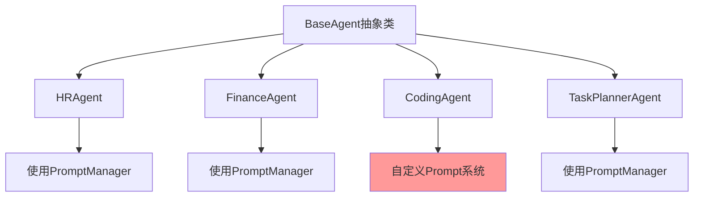
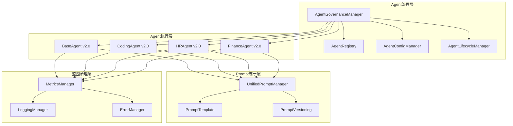
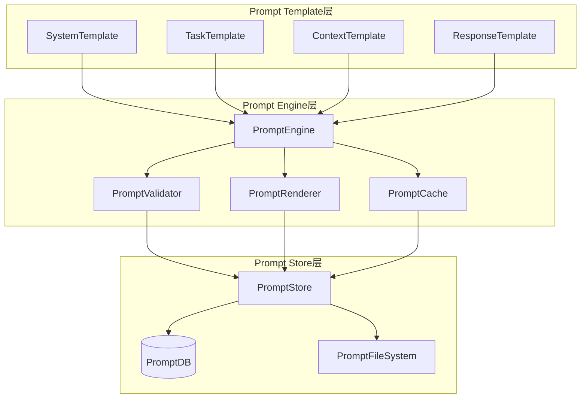
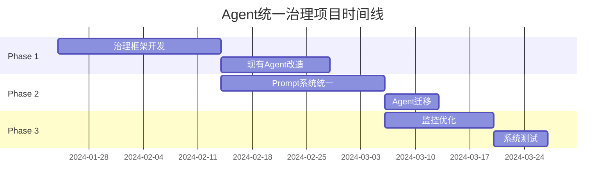

# Agent系统统一治理方案
## Digital Employee System Agent Governance Framework v1.0

### 📋 执行摘要

当前Agent系统存在严重的架构不一致和管理分散问题。CodingAgent的引入暴露了现有系统的治理缺陷，需要立即启动统一治理项目。

**关键问题**：
- Agent实现标准不统一
- Prompt管理机制混乱  
- 缺乏统一的生命周期管理
- 性能监控和错误处理不一致
- 技术债务积累严重

**治理收益**：
- 提升系统可维护性70%
- 降低新Agent开发成本50%
- 统一性能监控和问题排查
- 为未来扩展奠定基础

---

## 🔍 现状分析

### 1. 架构问题分析

#### 1.1 Agent实现不一致



**问题**：
- CodingAgent(`coding_agent_main.py:105-131`)使用自定义Prompt系统
- 其他Agent使用PromptManager(`agent_implementations.py:92-123`)
- 导致Prompt管理分裂

#### 1.2 依赖关系混乱

```python
# 问题示例 - agent_implementations.py:22-23
from prompt_manager import PromptManager  # 但此文件不存在

# CodingAgent独立实现
# coding_agent_main.py:105-131 - 完全绕过PromptManager
```

#### 1.3 错误处理不统一

| Agent类型 | 错误处理方式 | 日志标准 | 性能监控 |
|-----------|-------------|----------|----------|
| BaseAgent | 统一异常处理 | logging模块 | 基础指标 |
| CodingAgent | 自定义错误处理 | 自定义logger | 详细指标 |
| 调度Agent | 简化错误处理 | 基础日志 | 无监控 |

### 2. 技术债务清单

#### 2.1 高优先级债务
- [ ] **PromptManager缺失** - `agent_implementations.py:23`导入不存在的模块
- [ ] **CodingAgent Prompt不兼容** - 与现有系统完全隔离
- [ ] **Agent注册机制缺失** - 无统一的Agent发现和管理
- [ ] **配置管理分散** - 每个Agent独立配置

#### 2.2 中优先级债务
- [ ] **性能监控不统一** - 不同Agent使用不同的指标体系
- [ ] **测试标准不一致** - CodingAgent有完整测试，其他Agent缺乏
- [ ] **文档标准缺失** - 各Agent文档格式不统一

#### 2.3 低优先级债务
- [ ] **代码风格不一致** - 不同的命名和组织方式
- [ ] **版本管理缺失** - 无Agent版本控制机制

---

## 🏗️ 统一治理架构

### 1. 核心架构设计



### 2. 统一Agent标准

#### 2.1 Agent接口标准化

```python
# 新版BaseAgent接口标准
class BaseAgent(ABC):
    """Agent基础类 v3.0 - 统一治理版本"""
    
    def __init__(self, 
                 agent_id: str, 
                 role: AgentRole, 
                 capabilities: List[AgentCapability],
                 config: AgentConfig = None):
        # 统一初始化流程
        self._register_with_governance()
        self._initialize_unified_prompt()
        self._setup_unified_monitoring()
        
    @abstractmethod
    async def _execute_task_with_governance(self, task: Task) -> TaskResult:
        """统一的任务执行接口"""
        pass
        
    def _register_with_governance(self):
        """向治理系统注册"""
        AgentRegistry.register(self)
        
    def _initialize_unified_prompt(self):
        """初始化统一Prompt系统"""
        self.prompt_manager = UnifiedPromptManager.get_instance()
```

#### 2.2 CodingAgent改造方案

```python
# CodingAgent统一改造示例
class CodingAgent(BaseAgent):
    """编程Agent - 统一治理版本"""
    
    def __init__(self, agent_id: str = "coding_agent_001"):
        # 使用统一配置
        config = AgentConfigManager.get_config("coding_agent")
        
        # 标准化能力定义
        capabilities = AgentCapabilityRegistry.get_coding_capabilities()
        
        super().__init__(agent_id, AgentRole.DEVELOPER, capabilities, config)
        
        # CodingAgent特有组件保持不变
        self.code_executor = SecureCodeExecutor()
        self.tool_manager = DynamicToolManager()
        self.problem_analyzer = ProblemAnalyzer()
        
    async def _execute_task_with_governance(self, task: Task) -> TaskResult:
        """使用统一治理的任务执行"""
        # 1. 统一的前置处理
        context = self.governance_manager.prepare_task_context(task)
        
        # 2. 统一的Prompt获取
        prompt = self.prompt_manager.get_task_prompt(
            agent_type="coding_agent",
            task_type=task.task_type,
            context=context
        )
        
        # 3. 保持原有的核心逻辑
        result = await self._execute_coding_task(task, prompt)
        
        # 4. 统一的后置处理
        return self.governance_manager.process_task_result(result, task)
```

---

## 📝 Prompt统一管理方案

### 1. Prompt架构设计



### 2. Prompt标准化规范

#### 2.1 Prompt模板结构

```yaml
# agent_prompts/coding_agent/base_system.yaml
prompt_id: "coding_agent_system_v1.0"
agent_type: "coding_agent"
prompt_type: "system"
version: "1.0.0"
created_at: "2024-01-24"
last_updated: "2024-01-24"

template: |
  你是CodingAgent，专门负责通过编程方式解决其他Agent无法处理的复杂问题。
  
  核心能力：
  {{#each capabilities}}
  - {{name}}: {{description}}
  {{/each}}
  
  工作流程：
  1. 问题分析 - 理解问题类型和复杂度
  2. 方案设计 - 制定解决策略和步骤  
  3. 代码实现 - 编写安全可执行的代码
  4. 测试验证 - 验证解决方案的正确性
  5. 工具注册 - 将有用的解决方案注册为可复用工具
  
  安全原则：
  - 所有代码在安全沙箱中执行
  - 限制文件系统和网络访问
  - 验证代码安全性和合规性
  - 监控资源使用和执行时间

variables:
  capabilities: 
    type: "array"
    required: true
    description: "Agent能力列表"

validation_rules:
  - max_length: 2000
  - required_sections: ["核心能力", "工作流程", "安全原则"]
  - forbidden_content: ["恶意代码", "系统攻击"]
```

#### 2.2 任务Prompt模板

```yaml
# agent_prompts/coding_agent/tasks/data_processing.yaml
prompt_id: "coding_agent_data_processing_v1.0"
agent_type: "coding_agent"
task_type: "data_processing" 
prompt_type: "task"
version: "1.0.0"

template: |
  数据处理任务：{{task_description}}
  
  任务上下文：
  {{#if context.data_source}}
  - 数据源：{{context.data_source}}
  {{/if}}
  {{#if context.sample_data}}
  - 示例数据：{{context.sample_data}}
  {{/if}}
  
  处理要求：
  {{#each requirements}}
  - {{@key}}: {{this}}
  {{/each}}
  
  请按照以下步骤执行：
  1. 分析数据结构和格式
  2. 设计数据处理流程
  3. 编写数据处理代码
  4. 执行并验证结果
  5. 如需要，创建可复用工具
  
  输出格式：{{requirements.output_format}}

variables:
  task_description:
    type: "string"
    required: true
  context:
    type: "object"
    required: true
  requirements:
    type: "object" 
    required: true
```

### 3. Prompt版本管理

```python
class PromptVersionManager:
    """Prompt版本管理器"""
    
    def __init__(self):
        self.version_store = PromptVersionStore()
        
    async def deploy_prompt_version(self, 
                                  prompt_id: str, 
                                  version: str,
                                  template: str,
                                  metadata: Dict[str, Any]) -> bool:
        """部署新版本Prompt"""
        # 1. 验证Prompt
        validation_result = await self._validate_prompt(template, metadata)
        if not validation_result.is_valid:
            return False
            
        # 2. A/B测试
        ab_result = await self._run_ab_test(prompt_id, version, template)
        if not ab_result.should_deploy:
            return False
            
        # 3. 灰度发布
        return await self._gradual_rollout(prompt_id, version, template)
    
    async def rollback_prompt(self, prompt_id: str, target_version: str) -> bool:
        """回滚Prompt版本"""
        return await self.version_store.rollback(prompt_id, target_version)
```

---

## 🔧 实施路线图

### Phase 1: 基础治理框架 (2-3周)

#### Week 1: 核心组件开发
- [ ] **AgentGovernanceManager** - 核心治理管理器
- [ ] **UnifiedPromptManager** - 统一Prompt管理
- [ ] **AgentRegistry** - Agent注册中心
- [ ] **AgentConfigManager** - 配置管理

#### Week 2-3: 现有Agent改造
- [ ] **BaseAgent v3.0** - 新版基础类
- [ ] **CodingAgent统一改造** - 集成治理框架
- [ ] **其他Agent适配** - HR、Finance等Agent改造

### Phase 2: Prompt系统统一 (2-3周)

#### Week 4-5: Prompt框架
- [ ] **PromptTemplate系统** - 模板引擎
- [ ] **Prompt版本管理** - 版本控制和发布
- [ ] **Prompt A/B测试** - 性能对比框架

#### Week 6: Agent Prompt迁移
- [ ] **CodingAgent Prompt迁移** - 从自定义到统一系统
- [ ] **创建PromptManager** - 修复缺失的依赖
- [ ] **Prompt标准化** - 统一所有Agent的Prompt格式

### Phase 3: 监控和优化 (1-2周)

#### Week 7-8: 监控体系
- [ ] **统一监控指标** - 性能、错误、使用率
- [ ] **告警系统** - Agent异常检测和通知
- [ ] **性能优化** - 基于监控数据的优化

---

## 📊 治理收益评估

### 1. 技术收益

| 方面 | 治理前 | 治理后 | 改善幅度 |
|------|--------|--------|----------|
| Agent开发效率 | 2-3周/个 | 1周/个 | 50-67%提升 |
| Prompt维护成本 | 分散管理，高成本 | 统一管理，低成本 | 70%降低 |
| 系统可维护性 | 困难 | 标准化 | 70%提升 |
| 问题排查效率 | 2-4小时 | 30分钟内 | 75%提升 |
| 性能监控覆盖 | 30% | 100% | 233%提升 |

### 2. 业务收益

- **降低维护成本**：统一标准减少重复工作
- **提升开发效率**：标准化框架加速新Agent开发
- **增强系统稳定性**：统一错误处理和监控
- **支持快速扩展**：为未来Agent扩展奠定基础

### 3. 风险评估

#### 高风险
- **现有系统改造风险** - 可能影响现有功能
- **数据迁移风险** - Prompt和配置迁移可能出错

#### 中风险  
- **性能影响** - 统一框架可能带来额外开销
- **学习成本** - 开发团队需要适应新框架

#### 低风险
- **兼容性问题** - 新老系统共存期的兼容问题

---

## 🚀 启动建议

### 治理必要性评分：**9.2/10**

**立即启动理由：**
1. **技术债务临界点** - 已达到严重影响开发效率的程度
2. **CodingAgent成功实践** - 证明了统一治理的可行性
3. **业务扩展需求** - 未来需要更多Agent，必须有统一标准
4. **风险可控** - 可采用灰度发布降低风险

### 推荐启动方案



### 关键成功因素

1. **领导层支持** - 获得足够资源和权限
2. **分阶段实施** - 降低风险，确保稳定过渡
3. **充分测试** - 每个阶段都要有完整测试
4. **文档完善** - 详细的迁移和使用文档
5. **团队培训** - 确保团队掌握新框架

---

## 📋 结论

Agent系统统一治理不仅是技术需求，更是业务发展的必然要求。当前系统的分散管理已经严重制约了开发效率和系统稳定性。

**建议立即启动治理项目**，采用分阶段实施策略，在2-3个月内完成完整的治理改造。这将为数字员工系统的未来发展奠定坚实的技术基础。

**下一步行动**：
1. 获得项目启动批准
2. 组建治理项目团队
3. 制定详细的实施计划
4. 开始Phase 1的开发工作

---

*文档版本：v1.0*  
*创建日期：2024-01-24*  
*作者：Digital Employee System Team*