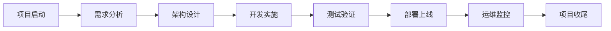
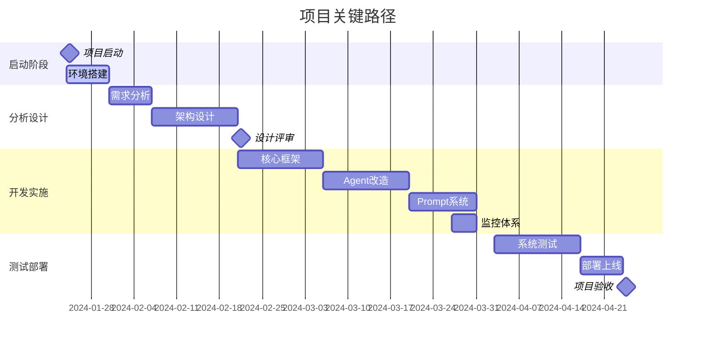
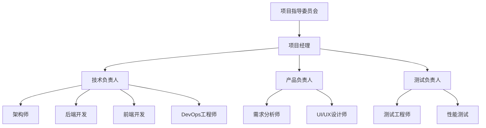
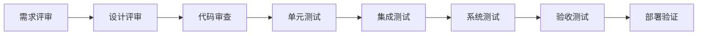
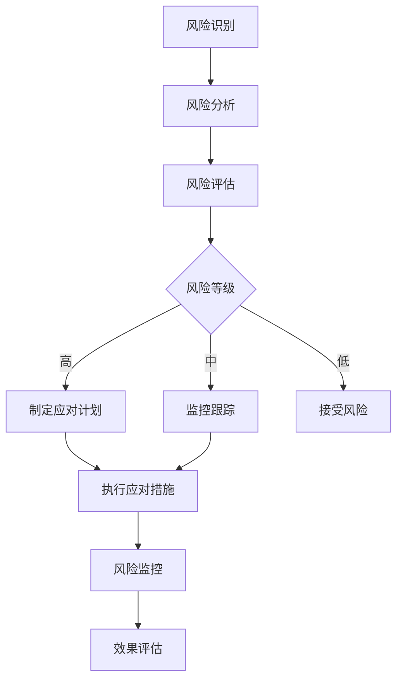
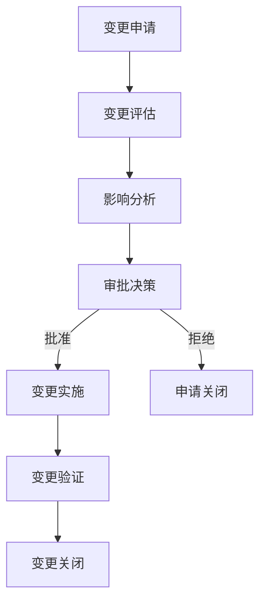

# 数字员工系统项目实施总纲
## Digital Employee System Project Implementation Charter v1.0

### 📋 文档信息
- **文档版本**: v1.0  
- **创建日期**: 2024-01-24
- **适用范围**: 数字员工系统Agent统一治理项目
- **维护部门**: 数字员工系统开发团队

---

## 🎯 项目概述

### 1.1 项目背景
数字员工系统经过初期快速发展，现有多个Agent（HR、Finance、Coding等）存在架构不一致、管理分散等问题，需要进行统一治理以支持系统的可持续发展。

### 1.2 项目目标
- **主要目标**: 建立统一的Agent治理框架，实现标准化管理
- **次要目标**: 提升开发效率50%，降低维护成本70%
- **长期目标**: 为未来Agent扩展和业务发展奠定技术基础

### 1.3 项目范围
- **包含范围**: Agent架构统一、Prompt管理、监控体系、文档规范
- **不包含范围**: 业务逻辑重构、用户界面改造、第三方系统集成

---

## 🔄 项目实施流程

### 2.1 项目生命周期



### 2.2 阶段划分与里程碑

#### Phase 1: 项目启动阶段 (1周)
**目标**: 建立项目基础，明确实施路线
**主要活动**:
- [ ] 项目启动会议
- [ ] 团队组建与角色分工
- [ ] 项目计划制定
- [ ] 风险评估与应对策略
- [ ] 开发环境搭建

**交付物**:
- 项目章程
- 项目计划书
- 风险管理计划
- 团队组织架构

**里程碑**: 项目正式启动 ✅

#### Phase 2: 需求分析阶段 (1周)
**目标**: 深入分析现状，明确治理需求
**主要活动**:
- [ ] 现有系统架构分析
- [ ] 技术债务评估  
- [ ] 业务需求收集
- [ ] 技术需求分析
- [ ] 可行性研究

**交付物**:
- 现状分析报告
- 需求规格说明书
- 可行性分析报告
- 技术债务清单

**里程碑**: 需求分析完成 ✅

#### Phase 3: 架构设计阶段 (2周)
**目标**: 设计统一治理架构方案
**主要活动**:
- [ ] 整体架构设计
- [ ] 详细技术方案设计
- [ ] 数据库设计
- [ ] 接口设计
- [ ] 安全方案设计

**交付物**:
- 系统架构设计文档
- 详细设计文档
- 数据库设计文档
- 接口设计文档
- 安全设计文档

**里程碑**: 架构设计评审通过 ✅

#### Phase 4: 开发实施阶段 (6周)
**目标**: 按设计方案实施开发
**主要活动**:
- [ ] 核心框架开发 (2周)
- [ ] Agent改造实施 (2周)
- [ ] Prompt系统开发 (1.5周)
- [ ] 监控体系开发 (0.5周)

**交付物**:
- 源代码
- 单元测试用例
- 开发文档
- 部署脚本

**里程碑**: 开发完成，代码提交 ✅

#### Phase 5: 测试验证阶段 (2周)
**目标**: 全面测试，确保质量
**主要活动**:
- [ ] 单元测试执行
- [ ] 集成测试执行
- [ ] 系统测试执行
- [ ] 性能测试执行
- [ ] 安全测试执行

**交付物**:
- 测试计划
- 测试用例
- 测试报告
- 缺陷修复记录

**里程碑**: 测试通过，质量达标 ✅

#### Phase 6: 部署上线阶段 (1周)
**目标**: 安全平稳上线
**主要活动**:
- [ ] 生产环境准备
- [ ] 灰度发布
- [ ] 全量部署
- [ ] 上线验证
- [ ] 问题应急处理

**交付物**:
- 部署文档
- 运维手册
- 应急预案
- 上线报告

**里程碑**: 系统成功上线 ✅

#### Phase 7: 运维监控阶段 (持续)
**目标**: 稳定运行，持续优化
**主要活动**:
- [ ] 系统监控
- [ ] 性能调优
- [ ] 问题处理
- [ ] 用户培训
- [ ] 持续改进

**交付物**:
- 监控报告
- 性能报告
- 问题处理记录
- 优化建议

**里程碑**: 系统稳定运行 ✅

### 2.3 项目关键路径



---

## 📊 项目管理规范

### 3.1 组织架构与角色职责

#### 3.1.1 项目组织架构



#### 3.1.2 角色职责矩阵

| 角色 | 主要职责 | 权限范围 | 考核指标 |
|------|---------|----------|----------|
| **项目经理** | 项目整体规划、进度控制、资源协调 | 项目全权管理 | 进度、质量、成本 |
| **技术负责人** | 技术方案制定、技术风险控制 | 技术决策权 | 技术质量、架构合理性 |
| **产品负责人** | 需求管理、产品质量把控 | 需求变更审批 | 需求实现度、用户满意度 |
| **架构师** | 系统架构设计、技术标准制定 | 架构设计决策权 | 架构合理性、可扩展性 |
| **后端开发** | 后端代码开发、接口实现 | 代码实现权 | 代码质量、开发效率 |
| **前端开发** | 前端界面开发、用户体验 | 前端实现权 | 界面质量、用户体验 |
| **测试负责人** | 测试策略制定、质量把控 | 测试标准制定权 | 缺陷发现率、测试覆盖率 |
| **DevOps工程师** | 自动化部署、运维监控 | 环境管理权 | 部署成功率、系统稳定性 |

### 3.2 沟通管理

#### 3.2.1 会议制度

| 会议类型 | 频率 | 参与人员 | 时长 | 目标 |
|----------|------|----------|------|------|
| **项目启动会** | 一次性 | 全体成员 | 2小时 | 明确目标、建立团队 |
| **每日站会** | 每日 | 开发团队 | 15分钟 | 同步进度、识别阻碍 |
| **周例会** | 每周 | 核心团队 | 1小时 | 进度汇报、问题讨论 |
| **里程碑评审** | 按里程碑 | 项目委员会 | 2小时 | 阶段总结、决策审批 |
| **技术评审** | 按需 | 技术团队 | 1-2小时 | 技术方案评审 |

#### 3.2.2 沟通矩阵

| 信息类型 | 发送方 | 接收方 | 频率 | 渠道 |
|----------|--------|--------|------|------|
| **项目进度** | 项目经理 | 项目委员会 | 周报 | 邮件+报告 |
| **技术问题** | 开发人员 | 技术负责人 | 实时 | 企业微信+Jira |
| **需求变更** | 产品负责人 | 项目经理 | 实时 | 正式申请 |
| **风险预警** | 各角色 | 项目经理 | 实时 | 风险管理系统 |

### 3.3 质量管理

#### 3.3.1 质量标准

| 质量维度 | 标准要求 | 度量指标 | 验收标准 |
|----------|----------|----------|----------|
| **功能质量** | 需求实现完整性 | 需求覆盖率≥95% | 功能测试通过 |
| **性能质量** | 响应时间合理 | 接口响应时间≤2s | 性能测试达标 |
| **安全质量** | 安全防护到位 | 安全扫描0高危漏洞 | 安全测试通过 |
| **代码质量** | 代码规范标准 | 代码覆盖率≥80% | 代码审查通过 |
| **文档质量** | 文档完整准确 | 文档完整性≥90% | 文档评审通过 |

#### 3.3.2 质量保证活动



### 3.4 风险管理

#### 3.4.1 风险识别矩阵

| 风险类别 | 风险描述 | 概率 | 影响 | 风险等级 | 应对策略 |
|----------|----------|------|------|----------|----------|
| **技术风险** | 现有系统改造复杂度超预期 | 中等 | 高 | 高 | 详细技术调研，分阶段实施 |
| **进度风险** | 开发人员不足导致延期 | 中等 | 中等 | 中 | 资源预留，外部支持 |
| **质量风险** | 系统改造影响现有功能 | 低 | 高 | 中 | 充分测试，灰度发布 |
| **需求风险** | 需求理解偏差导致返工 | 低 | 中等 | 低 | 需求澄清，原型验证 |

#### 3.4.2 风险应对流程



### 3.5 配置管理

#### 3.5.1 配置管理策略

| 配置项类型 | 版本控制策略 | 责任人 | 审批流程 |
|------------|--------------|--------|----------|
| **源代码** | Git分支管理 | 开发人员 | Code Review |
| **数据库脚本** | 版本化管理 | DBA | 变更审批 |
| **配置文件** | 环境隔离 | DevOps | 变更记录 |
| **文档** | 版本控制 | 文档负责人 | 评审发布 |

#### 3.5.2 分支管理策略

```mermaid
gitgraph
    commit id: "Initial"
    branch develop
    checkout develop
    commit id: "Feature A"
    branch feature/agent-governance
    checkout feature/agent-governance
    commit id: "Framework"
    commit id: "Refactor"
    checkout develop
    merge feature/agent-governance
    commit id: "Integration"
    checkout main
    merge develop tag: "v2.0.0"
```

### 3.6 变更管理

#### 3.6.1 变更分类与流程

| 变更类型 | 影响范围 | 审批级别 | 处理时限 |
|----------|----------|----------|----------|
| **紧急变更** | 系统故障修复 | 技术负责人 | 2小时内 |
| **正常变更** | 功能增加/修改 | 项目经理 | 3个工作日 |
| **重大变更** | 架构调整 | 项目委员会 | 1周 |

#### 3.6.2 变更控制流程



---

## 📈 项目监控与控制

### 4.1 进度监控

#### 4.1.1 进度跟踪工具
- **主工具**: Jira + Confluence
- **辅助工具**: Microsoft Project, Gantt图
- **实时监控**: 看板系统

#### 4.1.2 进度报告制度
- **日报**: 开发人员提交每日进度
- **周报**: 项目经理汇总周进度报告
- **月报**: 向项目委员会提交月度报告

### 4.2 质量监控

#### 4.2.1 代码质量监控
```yaml
代码质量指标:
  - 代码覆盖率: ≥80%
  - 复杂度: McCabe复杂度≤10
  - 重复代码率: ≤5%
  - 代码规范: 100%符合ESLint/Black规范
```

#### 4.2.2 缺陷管理
- **缺陷分级**: P0(阻塞) > P1(严重) > P2(一般) > P3(轻微)
- **处理时限**: P0(2小时), P1(1天), P2(3天), P3(1周)
- **质量门禁**: P0、P1缺陷清零才能发布

### 4.3 成本控制

#### 4.3.1 成本构成
- **人力成本**: 70% (开发、测试、管理人员)
- **基础设施成本**: 20% (服务器、工具、软件)
- **其他成本**: 10% (培训、差旅、应急)

#### 4.3.2 成本监控指标
- **预算执行率**: 实际支出/预算支出
- **人天利用率**: 实际工作人天/计划人天
- **ROI**: 项目收益/项目投入

---

## 📋 项目交付标准

### 5.1 交付物清单

#### 5.1.1 技术交付物
- [ ] **源代码** - 完整的系统源代码，包括注释
- [ ] **数据库脚本** - 建表、数据迁移、升级脚本
- [ ] **部署脚本** - 自动化部署和配置脚本
- [ ] **配置文件** - 各环境配置文件模板
- [ ] **技术文档** - 架构设计、接口文档、运维手册

#### 5.1.2 管理交付物
- [ ] **项目计划** - 详细的项目实施计划
- [ ] **测试报告** - 完整的测试执行报告
- [ ] **用户手册** - 系统使用说明文档
- [ ] **培训材料** - 用户培训和开发培训材料
- [ ] **项目总结** - 项目实施总结和经验教训

### 5.2 验收标准

#### 5.2.1 功能验收标准
- 所有需求功能100%实现
- 系统集成测试通过率≥95%
- 用户验收测试通过

#### 5.2.2 非功能验收标准
- 系统性能满足指标要求
- 安全测试无高危漏洞
- 系统可用性≥99.5%

### 5.3 项目收尾

#### 5.3.1 收尾活动清单
- [ ] 项目验收
- [ ] 知识转移
- [ ] 资源释放
- [ ] 经验总结
- [ ] 文档归档

#### 5.3.2 经验教训总结
定期收集和整理项目实施过程中的经验教训，形成知识库，为后续项目提供参考。

---

## 📚 附录

### A.1 项目术语表

| 术语 | 定义 |
|------|------|
| **Agent** | 数字员工系统中的智能代理，负责特定业务领域的任务处理 |
| **治理** | 对Agent系统进行统一管理、标准化和规范化的过程 |
| **Prompt** | 用于指导AI Agent行为的文本指令模板 |
| **技术债务** | 因快速开发而产生的代码质量问题和技术缺陷 |

### A.2 参考文档

- 《软件项目管理规范 GB/T 16260》
- 《信息技术项目管理实践指南》
- 《敏捷项目管理指南》
- 《代码质量管理标准》

### A.3 模板文件

- 项目计划模板
- 风险登记簿模板
- 变更申请表模板
- 项目状态报告模板
- 验收报告模板

---

**文档状态**: 正式发布  
**最后更新**: 2024-01-24  
**下次评审**: 2024-02-24  
**批准人**: 项目指导委员会