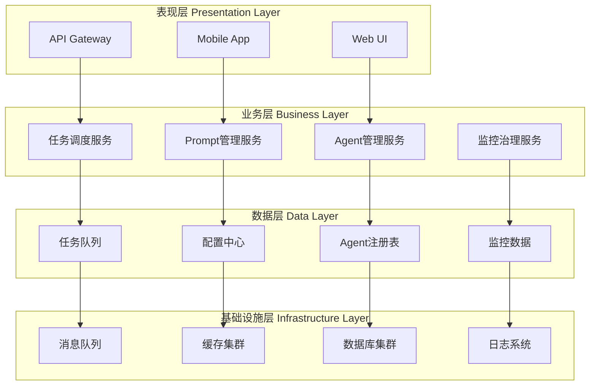
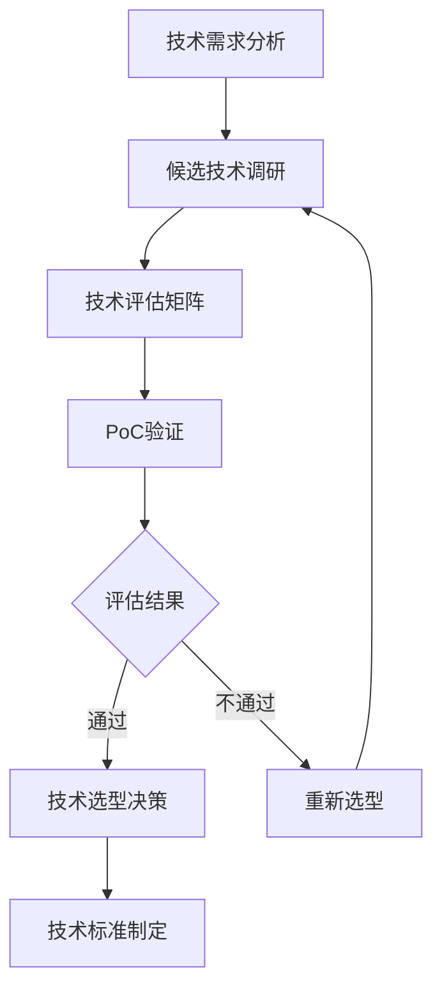
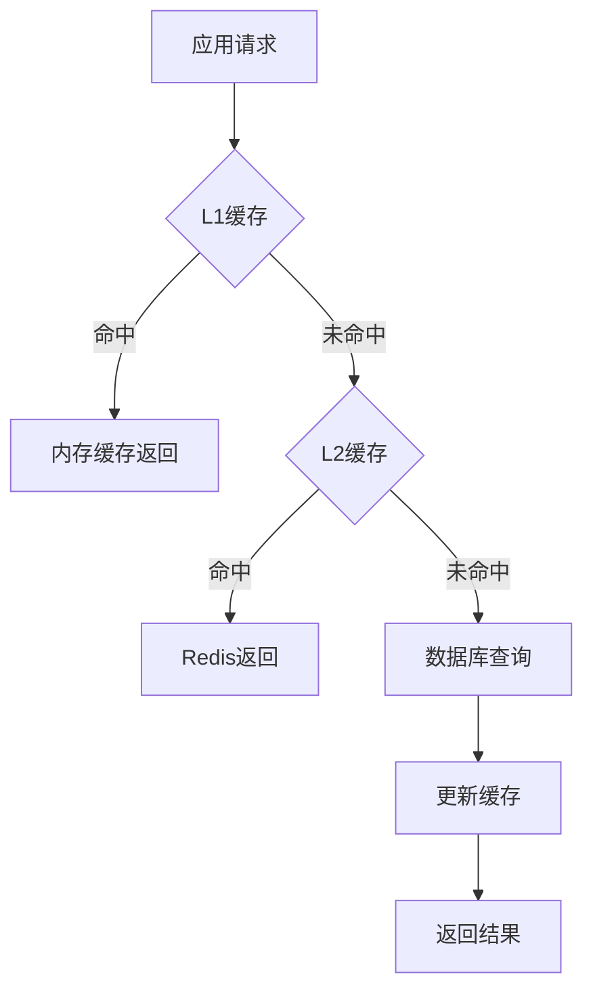

# 技术设计规范 & 技术栈要求
## Digital Employee System Technical Design Standards & Technology Stack Requirements v1.0 

### 📋 文档信息
- **文档版本**: v1.0
- **创建日期**: 2024-01-24  
- **适用范围**: 数字员工系统所有技术开发工作
- **维护部门**: 技术架构委员会

---

## 🏗️ 整体技术架构

### 1.1 系统架构设计原则

#### 1.1.1 核心设计原则

| 原则 | 描述 | 实施要求 |
|------|------|----------|
| **高内聚低耦合** | 模块内部功能紧密相关，模块间依赖最小 | 单一职责原则，接口隔离 |
| **可扩展性** | 系统能够轻松添加新功能和Agent | 插件化架构，配置驱动 |
| **高可用性** | 系统7×24小时稳定运行 | 故障转移，负载均衡 |
| **安全性** | 全方位安全防护机制 | 身份认证，权限控制，数据加密 |
| **可维护性** | 代码清晰，文档完整，易于维护 | 标准化开发，完整测试 |
| **性能优先** | 系统响应快速，资源利用高效 | 异步处理，缓存策略 |

#### 1.1.2 架构风格约定



### 1.2 技术选型标准

#### 1.2.1 技术选型评估矩阵

| 评估维度 | 权重 | 评分标准 | 最低要求 |
|----------|------|----------|----------|
| **技术成熟度** | 25% | 生产环境应用时间≥2年 | 8分以上 |
| **社区活跃度** | 20% | GitHub star≥5K，活跃贡献者≥100 | 7分以上 |
| **性能表现** | 20% | 基准测试达到行业平均水平 | 7分以上 |
| **学习成本** | 15% | 团队技能匹配度 | 6分以上 |
| **扩展性** | 10% | 支持水平扩展，插件机制 | 7分以上 |
| **维护成本** | 10% | 文档完整，工具生态丰富 | 6分以上 |

#### 1.2.2 技术选型决策流程



---

## 💻 后端技术栈

### 2.1 核心框架技术栈

#### 2.1.1 Python技术栈 (推荐)

```yaml
核心框架:
  web框架: FastAPI 0.104+
  异步框架: asyncio + uvloop
  数据验证: Pydantic 2.0+
  依赖注入: dependency-injector
  
数据层:
  ORM框架: SQLAlchemy 2.0+ (async)
  数据库驱动: asyncpg (PostgreSQL), aiomysql (MySQL)
  迁移工具: Alembic
  连接池: asyncpg-pool
  
缓存层:
  Redis客户端: aioredis 2.0+
  内存缓存: cachetools
  分布式缓存: Redis Cluster
  
消息队列:
  异步队列: Celery + Redis
  实时通信: WebSocket (FastAPI内置)
  事件总线: aio-pika (RabbitMQ)
  
监控观测:
  日志框架: structlog + loguru
  指标收集: prometheus-client
  链路追踪: opentelemetry
  性能监控: py-spy
```

#### 2.1.2 技术栈版本要求

| 组件 | 版本要求 | 选择理由 | 备注 |
|------|----------|----------|------|
| **Python** | 3.11+ | 性能提升，类型注解增强 | 必须支持async/await |
| **FastAPI** | 0.104+ | 高性能，自动API文档 | 替代Flask/Django |
| **SQLAlchemy** | 2.0+ | 异步支持，性能优化 | 必须使用异步模式 |
| **Pydantic** | 2.0+ | 数据验证，序列化 | 与FastAPI深度集成 |
| **Redis** | 7.0+ | 持久化，集群支持 | 用于缓存和队列 |
| **PostgreSQL** | 15+ | JSON支持，性能优化 | 主数据库 |

### 2.2 Agent核心技术规范

#### 2.2.1 Agent基础架构标准

```python
# Agent接口标准定义
from abc import ABC, abstractmethod
from typing import Dict, List, Any, Optional
from dataclasses import dataclass
from enum import Enum
import asyncio
import uuid
from datetime import datetime

@dataclass
class AgentConfig:
    """Agent配置标准"""
    agent_id: str
    agent_type: str
    version: str
    capabilities: List[str]
    max_concurrent_tasks: int = 10
    timeout_seconds: int = 300
    resource_limits: Dict[str, Any] = None
    
class TaskStatus(Enum):
    """任务状态枚举标准"""
    PENDING = "pending"
    RUNNING = "running" 
    COMPLETED = "completed"
    FAILED = "failed"
    CANCELLED = "cancelled"
    TIMEOUT = "timeout"

@dataclass
class TaskResult:
    """任务结果标准格式"""
    task_id: str
    status: TaskStatus
    result: Optional[Dict[str, Any]] = None
    error: Optional[str] = None
    execution_time: float = 0.0
    resource_usage: Dict[str, Any] = None
    created_at: datetime = None
    completed_at: datetime = None

class BaseAgent(ABC):
    """Agent基础类标准 v3.0"""
    
    def __init__(self, config: AgentConfig):
        self.config = config
        self.status = AgentStatus.INITIALIZING
        self.task_queue = asyncio.Queue(maxsize=config.max_concurrent_tasks)
        self.active_tasks: Dict[str, asyncio.Task] = {}
        
        # 统一组件初始化
        self._initialize_governance()
        self._initialize_monitoring()
        self._initialize_prompt_manager()
    
    @abstractmethod
    async def execute_task(self, task: Task) -> TaskResult:
        """执行任务的核心方法 - 必须实现"""
        pass
    
    def _initialize_governance(self):
        """初始化治理组件"""
        from .governance import AgentGovernanceManager
        self.governance = AgentGovernanceManager.get_instance()
        self.governance.register_agent(self)
    
    def _initialize_monitoring(self):
        """初始化监控组件"""
        from .monitoring import AgentMonitor
        self.monitor = AgentMonitor(self.config.agent_id)
    
    def _initialize_prompt_manager(self):
        """初始化Prompt管理器"""
        from .prompt import UnifiedPromptManager
        self.prompt_manager = UnifiedPromptManager.get_instance()
```

#### 2.2.2 Agent生命周期管理

```python
class AgentLifecycleManager:
    """Agent生命周期管理标准"""
    
    async def create_agent(self, agent_type: str, config: Dict[str, Any]) -> BaseAgent:
        """标准Agent创建流程"""
        # 1. 配置验证
        validated_config = await self._validate_config(agent_type, config)
        
        # 2. 依赖检查
        await self._check_dependencies(agent_type)
        
        # 3. 资源分配
        resources = await self._allocate_resources(validated_config)
        
        # 4. Agent实例化
        agent = await self._instantiate_agent(agent_type, validated_config)
        
        # 5. 健康检查
        await self._health_check(agent)
        
        # 6. 注册到系统
        await self._register_agent(agent)
        
        return agent
    
    async def destroy_agent(self, agent_id: str) -> bool:
        """标准Agent销毁流程"""
        # 1. 停止接收新任务
        await self._stop_accepting_tasks(agent_id)
        
        # 2. 等待现有任务完成
        await self._wait_for_tasks_completion(agent_id)
        
        # 3. 清理资源
        await self._cleanup_resources(agent_id)
        
        # 4. 注销Agent
        await self._unregister_agent(agent_id)
        
        return True
```

### 2.3 数据处理技术规范

#### 2.3.1 数据库访问层标准

```python
# 数据访问层统一接口
class BaseRepository(ABC):
    """数据仓库基础类"""
    
    def __init__(self, db_session: AsyncSession):
        self.db = db_session
    
    @abstractmethod
    async def create(self, entity: Any) -> Any:
        """创建实体"""
        pass
    
    @abstractmethod
    async def get_by_id(self, entity_id: str) -> Optional[Any]:
        """根据ID获取实体"""
        pass
    
    @abstractmethod
    async def update(self, entity_id: str, data: Dict[str, Any]) -> Optional[Any]:
        """更新实体"""
        pass
    
    @abstractmethod
    async def delete(self, entity_id: str) -> bool:
        """删除实体"""
        pass
    
    async def get_by_filter(self, **filters) -> List[Any]:
        """根据条件查询"""
        # 统一的查询实现
        pass

# 使用示例
class AgentRepository(BaseRepository):
    """Agent数据仓库"""
    
    async def create(self, agent: Agent) -> Agent:
        self.db.add(agent)
        await self.db.commit()
        await self.db.refresh(agent)
        return agent
    
    async def get_active_agents(self) -> List[Agent]:
        result = await self.db.execute(
            select(Agent).where(Agent.status == AgentStatus.ACTIVE)
        )
        return result.scalars().all()
```

#### 2.3.2 缓存策略标准

```python
class CacheManager:
    """统一缓存管理器"""
    
    def __init__(self, redis_client: aioredis.Redis):
        self.redis = redis_client
        self.default_ttl = 3600  # 1小时
    
    async def get_or_set(self, 
                        key: str, 
                        factory: Callable,
                        ttl: int = None) -> Any:
        """缓存获取或设置模式"""
        # 1. 尝试从缓存获取
        cached_value = await self.redis.get(key)
        if cached_value:
            return json.loads(cached_value)
        
        # 2. 调用工厂方法获取数据
        value = await factory()
        
        # 3. 设置缓存
        await self.redis.setex(
            key, 
            ttl or self.default_ttl, 
            json.dumps(value, default=str)
        )
        
        return value
    
    async def invalidate_pattern(self, pattern: str):
        """按模式批量删除缓存"""
        keys = await self.redis.keys(pattern)
        if keys:
            await self.redis.delete(*keys)
```

---

## 🗄️ 数据层技术要求

### 3.1 数据库技术栈

#### 3.1.1 主数据库 - PostgreSQL

```yaml
版本要求: PostgreSQL 15+
扩展组件:
  - uuid-ossp: UUID生成
  - pg_stat_statements: 性能监控
  - pg_trgm: 全文搜索
  - jsonb_plpython3u: JSON处理

连接池配置:
  min_connections: 10
  max_connections: 100
  max_inactive_connection_lifetime: 300
  
性能优化:
  shared_buffers: 256MB
  effective_cache_size: 1GB
  work_mem: 16MB
  maintenance_work_mem: 256MB
```

#### 3.1.2 时序数据库 - InfluxDB

```yaml
版本要求: InfluxDB 2.0+
用途: Agent性能指标，监控数据
配置:
  retention_policy: 30天
  shard_duration: 1天
  replication_factor: 2
```

#### 3.1.3 文档数据库 - MongoDB (可选)

```yaml
版本要求: MongoDB 6.0+
用途: Prompt模板，非结构化数据
配置:
  replica_set: 3节点
  write_concern: majority
  read_preference: primaryPreferred
```

### 3.2 缓存技术要求

#### 3.2.1 Redis集群配置

```yaml
版本要求: Redis 7.0+
部署模式: Redis Cluster (3主3从)
配置参数:
  maxmemory: 2GB
  maxmemory-policy: allkeys-lru
  save: "900 1 300 10 60 10000"
  appendonly: yes
  appendfsync: everysec
```

#### 3.2.2 缓存分层策略



---

## 🔐 安全技术要求

### 4.1 身份认证与授权

#### 4.1.1 认证技术栈

```yaml
认证协议: OAuth 2.0 + JWT
JWT配置:
  algorithm: RS256
  expiration: 15分钟 (access_token)
  refresh_expiration: 7天 (refresh_token)
  issuer: digital-employee-system
  
密码安全:
  hash_algorithm: bcrypt
  salt_rounds: 12
  min_password_length: 8
  password_complexity: 必须包含大小写字母、数字、特殊字符
```

#### 4.1.2 权限控制模型

```python
# RBAC权限模型实现
class Permission(BaseModel):
    """权限定义"""
    resource: str  # 资源类型，如 'agent', 'task', 'prompt'
    action: str    # 操作类型，如 'create', 'read', 'update', 'delete'
    conditions: Dict[str, Any] = {}  # 条件限制

class Role(BaseModel):
    """角色定义"""
    role_id: str
    role_name: str
    permissions: List[Permission]
    
class User(BaseModel):
    """用户定义"""
    user_id: str
    username: str
    roles: List[str]  # 角色ID列表

@contextmanager  
async def require_permission(resource: str, action: str):
    """权限检查装饰器"""
    current_user = get_current_user()
    if not await check_permission(current_user, resource, action):
        raise HTTPException(status_code=403, detail="权限不足")
    yield
```

### 4.2 数据安全

#### 4.2.1 数据加密标准

```yaml
传输加密:
  protocol: TLS 1.3
  cipher_suites: AEAD (AES-GCM, ChaCha20-Poly1305)
  key_exchange: ECDHE
  
存储加密:
  algorithm: AES-256-GCM
  key_management: HashiCorp Vault
  key_rotation: 90天
  
敏感数据处理:
  PII数据: 必须加密存储
  密码: bcrypt哈希
  API密钥: 加密存储，限制访问权限
```

#### 4.2.2 安全审计

```python
class SecurityAuditLogger:
    """安全审计日志"""
    
    async def log_authentication(self, user_id: str, action: str, result: str):
        """记录认证事件"""
        await self._log_security_event({
            "event_type": "authentication",
            "user_id": user_id,
            "action": action,
            "result": result,
            "timestamp": datetime.utcnow(),
            "ip_address": get_client_ip(),
            "user_agent": get_user_agent()
        })
    
    async def log_authorization(self, user_id: str, resource: str, action: str, result: str):
        """记录授权事件"""
        await self._log_security_event({
            "event_type": "authorization", 
            "user_id": user_id,
            "resource": resource,
            "action": action,
            "result": result,
            "timestamp": datetime.utcnow()
        })
```

---

## 📊 监控与可观测性

### 5.1 监控技术栈

#### 5.1.1 指标监控 - Prometheus + Grafana

```yaml
Prometheus配置:
  version: 2.40+
  scrape_interval: 15s
  evaluation_interval: 15s
  retention: 15天
  storage: 本地存储 + 远程存储(可选)

Grafana配置:  
  version: 9.0+
  datasources: Prometheus, InfluxDB, Elasticsearch
  dashboards: Agent性能、系统资源、业务指标
  alerting: 基于阈值和异常检测
```

#### 5.1.2 日志监控 - ELK Stack

```yaml
Elasticsearch:
  version: 8.0+
  nodes: 3节点集群
  indices: 按日期分片，7天轮转

Logstash:
  version: 8.0+
  inputs: filebeat, http, redis
  filters: grok, mutate, date
  outputs: elasticsearch

Kibana:
  version: 8.0+
  dashboards: 日志分析，错误追踪
  alerting: 异常日志告警
```

#### 5.1.3 链路追踪 - Jaeger

```yaml
版本要求: Jaeger 1.40+
部署模式: All-in-one (开发) / Production (生产)
采样策略: 
  - 错误请求: 100%采样
  - 正常请求: 1%采样
  - 慢请求(>2s): 100%采样
存储: Elasticsearch / Cassandra
```

### 5.2 性能监控标准

#### 5.2.1 关键性能指标(KPI)

```yaml
系统层面指标:
  - CPU使用率: <70%
  - 内存使用率: <80%  
  - 磁盘使用率: <85%
  - 网络延迟: <50ms

应用层面指标:
  - API响应时间: P95 < 2s
  - 吞吐量: >1000 TPS
  - 错误率: <0.1%
  - 系统可用性: >99.9%

Agent层面指标:
  - 任务完成率: >95%
  - 平均任务执行时间: <30s
  - Agent响应时间: <1s
  - 资源利用率: 60-80%
```

#### 5.2.2 告警规则配置

```yaml
# prometheus告警规则示例
groups:
  - name: system_alerts
    rules:
      - alert: HighCPUUsage
        expr: cpu_usage_percent > 80
        for: 5m
        labels:
          severity: warning
        annotations:
          summary: "CPU使用率过高"
          
      - alert: AgentTaskFailure
        expr: agent_task_failure_rate > 0.05
        for: 2m
        labels:
          severity: critical
        annotations:
          summary: "Agent任务失败率过高"
```

---

## 🚀 部署与运维

### 6.1 容器化技术要求

#### 6.1.1 Docker标准

```dockerfile
# Dockerfile标准模板
FROM python:3.11-slim

# 标准化标签
LABEL maintainer="team@company.com"
LABEL version="1.0.0"
LABEL description="Digital Employee Agent"

# 系统依赖
RUN apt-get update && apt-get install -y \
    gcc \
    g++ \
    && rm -rf /var/lib/apt/lists/*

# Python依赖
COPY requirements.txt .
RUN pip install --no-cache-dir -r requirements.txt

# 应用代码
WORKDIR /app
COPY . .

# 安全性：非root用户
RUN useradd -m -u 1000 appuser
RUN chown -R appuser:appuser /app
USER appuser

# 健康检查
HEALTHCHECK --interval=30s --timeout=3s --start-period=5s --retries=3 \
  CMD curl -f http://localhost:8000/health || exit 1

# 启动命令
CMD ["uvicorn", "main:app", "--host", "0.0.0.0", "--port", "8000"]
```

#### 6.1.2 Kubernetes部署规范

```yaml
# k8s部署标准模板
apiVersion: apps/v1
kind: Deployment
metadata:
  name: digital-employee-agent
  labels:
    app: digital-employee
    component: agent
    version: v1.0.0
spec:
  replicas: 3
  selector:
    matchLabels:
      app: digital-employee
      component: agent
  template:
    metadata:
      labels:
        app: digital-employee
        component: agent
    spec:
      containers:
      - name: agent
        image: digital-employee/agent:v1.0.0
        ports:
        - containerPort: 8000
        env:
        - name: DATABASE_URL
          valueFrom:
            secretKeyRef:
              name: db-secret
              key: url
        resources:
          requests:
            memory: "256Mi"
            cpu: "250m"
          limits:
            memory: "512Mi" 
            cpu: "500m"
        livenessProbe:
          httpGet:
            path: /health
            port: 8000
          initialDelaySeconds: 30
          periodSeconds: 10
        readinessProbe:
          httpGet:
            path: /ready
            port: 8000
          initialDelaySeconds: 5
          periodSeconds: 5
```

### 6.2 CI/CD流水线

#### 6.2.1 GitLab CI标准流水线

```yaml
# .gitlab-ci.yml
stages:
  - test
  - build
  - security
  - deploy

variables:
  DOCKER_REGISTRY: "registry.company.com"
  IMAGE_NAME: "digital-employee/agent"

# 代码质量检查
code_quality:
  stage: test
  script:
    - pip install flake8 black mypy
    - black --check .
    - flake8 .
    - mypy .
  rules:
    - if: $CI_MERGE_REQUEST_ID

# 单元测试
unit_tests:
  stage: test
  script:
    - pip install -r requirements-test.txt
    - pytest --cov=src --cov-report=xml
    - coverage report --fail-under=80
  coverage: '/TOTAL.*\s+(\d+%)$/'
  artifacts:
    reports:
      coverage_report:
        coverage_format: cobertura
        path: coverage.xml

# 构建镜像
build_image:
  stage: build
  script:
    - docker build -t $IMAGE_NAME:${CI_COMMIT_SHA} .
    - docker push $IMAGE_NAME:${CI_COMMIT_SHA}
  rules:
    - if: $CI_COMMIT_BRANCH == "main"

# 安全扫描
security_scan:
  stage: security
  script:
    - trivy image --exit-code 1 --severity HIGH,CRITICAL $IMAGE_NAME:${CI_COMMIT_SHA}
  rules:
    - if: $CI_COMMIT_BRANCH == "main"

# 部署到生产
deploy_production:
  stage: deploy
  script:
    - kubectl set image deployment/agent agent=$IMAGE_NAME:${CI_COMMIT_SHA}
    - kubectl rollout status deployment/agent
  environment:
    name: production
  rules:
    - if: $CI_COMMIT_BRANCH == "main"
      when: manual
```

---

## 📋 代码质量要求

### 7.1 代码规范标准

#### 7.1.1 Python代码规范

```yaml
代码风格:
  formatter: black
  line_length: 88
  import_sorting: isort
  
类型检查:
  tool: mypy
  strict_mode: true
  disallow_untyped_defs: true
  
代码检查:
  tool: flake8 + pylint
  max_complexity: 10
  max_line_length: 88
  
文档规范:
  docstring_style: Google Style
  coverage_requirement: 100% (公共API)
```

#### 7.1.2 代码质量门禁

```python
# pre-commit钩子配置
repos:
  - repo: https://github.com/psf/black
    rev: 22.10.0
    hooks:
      - id: black
        language_version: python3.11

  - repo: https://github.com/pycqa/isort
    rev: 5.10.1
    hooks:
      - id: isort
        args: ["--profile", "black"]

  - repo: https://github.com/pycqa/flake8
    rev: 5.0.4
    hooks:
      - id: flake8
        additional_dependencies: [flake8-docstrings]

  - repo: https://github.com/pre-commit/mirrors-mypy
    rev: v0.991
    hooks:
      - id: mypy
        additional_dependencies: [types-all]
```

### 7.2 测试标准

#### 7.2.1 测试策略

```mermaid
pyramid
    title 测试金字塔
    section 端到端测试
        E2E Tests : 5%
    section 集成测试  
        Integration Tests : 15%
    section 单元测试
        Unit Tests : 80%
```

#### 7.2.2 测试覆盖率要求

| 模块类型 | 覆盖率要求 | 测试类型 |
|----------|------------|----------|
| **核心业务逻辑** | ≥95% | 单元测试 + 集成测试 |
| **API接口** | ≥90% | 接口测试 + 单元测试 |
| **数据访问层** | ≥85% | 单元测试 + 数据库测试 |
| **工具类/帮助类** | ≥80% | 单元测试 |
| **配置/常量** | ≥60% | 单元测试 |

#### 7.2.3 测试代码标准

```python
# 单元测试标准模板
import pytest
from unittest.mock import Mock, patch
from src.agents.base_agent import BaseAgent

class TestBaseAgent:
    """BaseAgent单元测试类"""
    
    @pytest.fixture
    def agent_config(self):
        """测试配置fixture"""
        return AgentConfig(
            agent_id="test_agent",
            agent_type="test",
            version="1.0.0",
            capabilities=["test_capability"]
        )
    
    @pytest.fixture
    def mock_agent(self, agent_config):
        """Mock Agent fixture"""
        return BaseAgent(agent_config)
    
    async def test_execute_task_success(self, mock_agent):
        """测试任务执行成功场景"""
        # Given
        task = Task(task_id="test", task_type="test", data={})
        
        # When  
        result = await mock_agent.execute_task(task)
        
        # Then
        assert result.status == TaskStatus.COMPLETED
        assert result.task_id == "test"
    
    async def test_execute_task_failure(self, mock_agent):
        """测试任务执行失败场景"""
        # Given
        task = Task(task_id="test", task_type="invalid", data={})
        
        # When & Then
        with pytest.raises(ValueError):
            await mock_agent.execute_task(task)
    
    @patch('src.agents.base_agent.MonitoringService')
    async def test_monitoring_integration(self, mock_monitoring, mock_agent):
        """测试监控集成"""
        # Given
        task = Task(task_id="test", task_type="test", data={})
        
        # When
        await mock_agent.execute_task(task)
        
        # Then
        mock_monitoring.record_task_execution.assert_called_once()
```

---

## 📚 技术文档要求

### 8.1 文档标准

#### 8.1.1 API文档规范

```yaml
API文档标准:
  格式: OpenAPI 3.0.3
  工具: FastAPI自动生成 + Swagger UI
  必需内容:
    - 接口描述
    - 请求参数说明
    - 响应格式定义
    - 错误码说明
    - 示例请求/响应
    - 认证方式说明
```

#### 8.1.2 代码文档规范

```python
class AgentManager:
    """Agent管理器
    
    负责Agent的生命周期管理，包括创建、销毁、监控等功能。
    
    Attributes:
        agents: 当前活跃的Agent实例字典
        config: Agent管理器配置
        
    Example:
        >>> manager = AgentManager(config)
        >>> agent = await manager.create_agent("hr_agent", agent_config)
        >>> await manager.destroy_agent(agent.agent_id)
    """
    
    def __init__(self, config: AgentManagerConfig):
        """初始化Agent管理器
        
        Args:
            config: Agent管理器配置对象
            
        Raises:
            ValueError: 当配置无效时抛出
        """
        pass
    
    async def create_agent(self, agent_type: str, config: Dict[str, Any]) -> BaseAgent:
        """创建新的Agent实例
        
        Args:
            agent_type: Agent类型，如 'hr_agent', 'finance_agent'
            config: Agent配置字典
            
        Returns:
            创建的Agent实例
            
        Raises:
            AgentCreationError: 当Agent创建失败时抛出
            ConfigurationError: 当配置无效时抛出
            
        Example:
            >>> config = {"max_tasks": 10, "timeout": 300}
            >>> agent = await manager.create_agent("hr_agent", config)
        """
        pass
```

### 8.2 架构文档要求

#### 8.2.1 架构决策记录(ADR)模板

```markdown
# ADR-001: 选择FastAPI作为Web框架

## 状态
已接受

## 背景
需要选择Python Web框架来构建Agent管理API。

## 决策
选择FastAPI作为主要Web框架。

## 理由
1. 高性能：基于Starlette和Pydantic，性能优异
2. 类型安全：原生支持类型注解和验证
3. 自动文档：自动生成OpenAPI文档
4. 异步支持：原生async/await支持
5. 生态丰富：丰富的插件和扩展

## 后果
- 正面：开发效率高，文档自动化，性能优异
- 负面：相对较新，某些功能可能不如Django成熟
- 中性：需要团队学习新框架

## 替代方案
- Django REST Framework: 功能全面但性能较低
- Flask: 轻量但需要更多配置
```

---

## 🔧 开发工具链

### 9.1 开发环境要求

#### 9.1.1 本地开发环境

```yaml
Python环境:
  版本: Python 3.11+
  包管理: poetry / pip-tools
  虚拟环境: venv / conda
  
IDE配置:
  推荐: VS Code / PyCharm
  插件: Python, Pylance, GitLens, Docker
  配置: .vscode/settings.json统一配置
  
开发工具:
  代码格式化: black, isort
  代码检查: flake8, pylint, mypy
  测试工具: pytest, coverage
  调试工具: pdb, pytest-xvs
```

#### 9.1.2 项目结构标准

```
digital_employee_system/
├── src/                          # 源代码目录
│   ├── agents/                   # Agent模块
│   │   ├── __init__.py
│   │   ├── base_agent.py        # Agent基础类
│   │   ├── hr_agent.py          # HR Agent
│   │   └── coding_agent.py      # Coding Agent
│   ├── governance/               # 治理模块
│   │   ├── __init__.py
│   │   ├── registry.py          # Agent注册
│   │   └── lifecycle.py         # 生命周期管理
│   ├── prompt/                   # Prompt管理
│   │   ├── __init__.py
│   │   ├── manager.py           # Prompt管理器
│   │   └── templates/           # Prompt模板
│   └── monitoring/               # 监控模块
│       ├── __init__.py
│       ├── metrics.py           # 指标收集
│       └── health.py            # 健康检查
├── tests/                        # 测试代码
│   ├── unit/                    # 单元测试
│   ├── integration/             # 集成测试
│   └── e2e/                     # 端到端测试
├── docs/                         # 文档目录
│   ├── api/                     # API文档
│   ├── architecture/            # 架构文档
│   └── user_guide/              # 用户指南
├── deployment/                   # 部署相关
│   ├── docker/                  # Docker文件
│   ├── k8s/                     # Kubernetes配置
│   └── scripts/                 # 部署脚本
├── config/                       # 配置文件
│   ├── development.yaml         # 开发环境配置
│   ├── production.yaml          # 生产环境配置
│   └── test.yaml               # 测试环境配置
├── requirements/                 # 依赖文件
│   ├── base.txt                # 基础依赖
│   ├── development.txt         # 开发依赖
│   └── production.txt          # 生产依赖
├── .github/                      # GitHub Actions
├── .gitlab-ci.yml               # GitLab CI配置
├── pyproject.toml               # Python项目配置
├── docker-compose.yml           # 本地开发环境
└── README.md                    # 项目说明
```

### 9.2 版本管理规范

#### 9.2.1 Git工作流

```mermaid
gitgraph
    commit id: "Initial"
    branch develop
    checkout develop
    commit id: "Feature base"
    branch feature/agent-governance
    checkout feature/agent-governance
    commit id: "Add governance"
    commit id: "Add tests"
    checkout develop
    merge feature/agent-governance
    commit id: "Integration"
    branch release/v2.0.0
    checkout release/v2.0.0
    commit id: "Prepare release"
    checkout main
    merge release/v2.0.0 tag: "v2.0.0"
    checkout develop
    merge main
```

#### 9.2.2 提交信息规范

```bash
# 提交信息格式
<type>(<scope>): <subject>

<body>

<footer>

# 示例
feat(agent): add unified prompt management

- Implement UnifiedPromptManager class
- Add prompt template validation
- Support multi-version prompt management

Closes #123
```

---

## 📋 技术债务管理

### 10.1 技术债务识别

#### 10.1.1 债务类型分类

| 债务类型 | 严重程度 | 影响范围 | 处理策略 |
|----------|----------|----------|----------|
| **架构债务** | 高 | 系统级 | 优先重构 |
| **代码债务** | 中 | 模块级 | 迭代改进 |
| **测试债务** | 中 | 质量保障 | 补充测试 |
| **文档债务** | 低 | 维护效率 | 定期更新 |

#### 10.1.2 技术债务度量

```python
class TechnicalDebtMetrics:
    """技术债务度量工具"""
    
    def calculate_code_quality_score(self, project_path: str) -> float:
        """计算代码质量分数"""
        metrics = {
            'complexity': self._calculate_complexity(project_path),
            'duplication': self._calculate_duplication(project_path), 
            'coverage': self._calculate_test_coverage(project_path),
            'maintainability': self._calculate_maintainability(project_path)
        }
        
        # 加权计算总分
        weights = {'complexity': 0.3, 'duplication': 0.2, 'coverage': 0.3, 'maintainability': 0.2}
        total_score = sum(metrics[key] * weights[key] for key in weights)
        
        return total_score
```

---

## 📈 性能优化要求

### 11.1 性能基准

#### 11.1.1 响应时间要求

| 操作类型 | 响应时间目标 | 最大可接受时间 |
|----------|--------------|----------------|
| **Agent状态查询** | <100ms | <500ms |
| **简单任务执行** | <2s | <5s |
| **复杂任务执行** | <30s | <60s |
| **批量操作** | <10s | <30s |

#### 11.1.2 并发性能要求

```yaml
并发指标:
  同时在线用户: 1000+
  并发请求数: 500 TPS
  Agent并发任务: 100个/Agent
  系统总并发任务: 10000+
  
资源限制:
  单Agent内存: <512MB
  单Agent CPU: <0.5 core
  数据库连接池: 100连接
  Redis连接池: 50连接
```

### 11.2 性能优化策略

#### 11.2.1 异步处理优化

```python
# 异步任务处理示例
class TaskProcessor:
    """异步任务处理器"""
    
    def __init__(self, max_workers: int = 10):
        self.semaphore = asyncio.Semaphore(max_workers)
        self.task_queue = asyncio.Queue()
        
    async def process_tasks(self):
        """处理任务队列"""
        while True:
            task = await self.task_queue.get()
            asyncio.create_task(self._process_single_task(task))
            
    async def _process_single_task(self, task):
        """处理单个任务"""
        async with self.semaphore:
            try:
                result = await self._execute_task(task)
                await self._save_result(result)
            except Exception as e:
                await self._handle_error(task, e)
            finally:
                self.task_queue.task_done()
```

---

## 🔄 版本管理与发布

### 12.1 版本号规范

#### 12.1.1 语义化版本控制

```yaml
版本格式: MAJOR.MINOR.PATCH[-PRERELEASE][+BUILD]

版本递增规则:
  MAJOR: 不兼容的API修改
  MINOR: 向后兼容的功能性新增
  PATCH: 向后兼容的问题修正
  PRERELEASE: 预发布版本标识
  BUILD: 版本元数据

示例:
  - 1.0.0: 首个正式版本
  - 1.1.0: 新增功能
  - 1.1.1: 修复bug
  - 2.0.0-alpha.1: 大版本预发布
  - 2.0.0+20240124: 带构建信息
```

#### 12.1.2 发布流程


---

**文档状态**: 正式发布  
**最后更新**: 2024-01-24  
**下次评审**: 2024-03-24  
**批准人**: 技术架构委员会