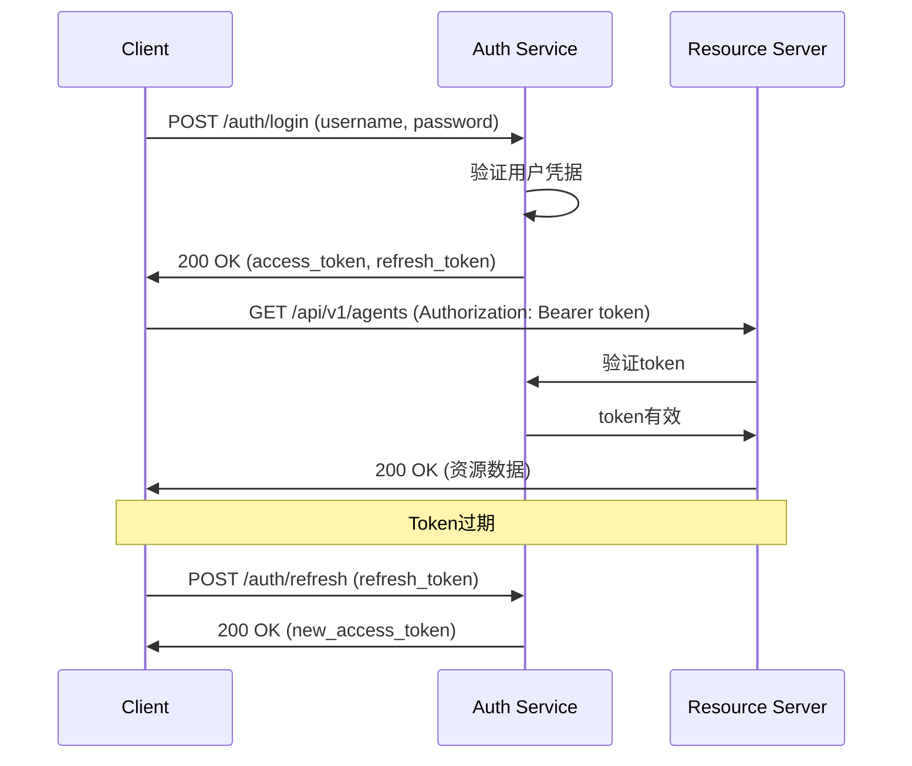

# 数字员工系统API设计规范
## Digital Employee System API Design Standards v1.0

### 📋 文档信息
- **文档版本**: v1.0
- **创建日期**: 2024-01-24
- **适用范围**: 数字员工系统所有API接口设计
- **维护部门**: API架构组

---

## 🎯 API设计原则

### 1.1 RESTful设计原则

#### 1.1.1 核心原则

| 原则 | 描述 | 实施要求 |
|------|------|----------|
| **统一接口** | 使用标准HTTP方法和状态码 | GET/POST/PUT/DELETE语义明确 |
| **无状态** | 每个请求包含完整信息 | 不依赖服务器端会话状态 |
| **可缓存** | 响应标明缓存策略 | 适当设置Cache-Control头 |
| **分层系统** | 支持代理、网关等中间层 | 接口设计对中间层透明 |
| **按需代码** | 支持客户端扩展 | 提供SDK和代码生成 |
| **资源导向** | URL表示资源而非动作 | 名词复数形式表示资源集合 |

#### 1.1.2 HTTP方法使用规范

```yaml
# HTTP方法使用标准
http_methods:
  GET:
    purpose: "获取资源"
    idempotent: true
    safe: true
    examples:
      - "GET /api/v1/agents"
      - "GET /api/v1/agents/{id}"
      
  POST:
    purpose: "创建资源"
    idempotent: false
    safe: false
    examples:
      - "POST /api/v1/agents"
      - "POST /api/v1/agents/{id}/tasks"
      
  PUT:
    purpose: "完整更新资源"
    idempotent: true
    safe: false
    examples:
      - "PUT /api/v1/agents/{id}"
      
  PATCH:
    purpose: "部分更新资源"
    idempotent: true
    safe: false
    examples:
      - "PATCH /api/v1/agents/{id}"
      
  DELETE:
    purpose: "删除资源"
    idempotent: true
    safe: false
    examples:
      - "DELETE /api/v1/agents/{id}"
```

### 1.2 URL设计规范

#### 1.2.1 路径结构标准

```
# URL结构模板
https://{domain}/api/{version}/{resource}/{resource_id}/{sub_resource}?{query_params}

# 组成部分说明
domain: API服务域名
version: API版本号(v1, v2)
resource: 资源名称(复数形式)
resource_id: 资源标识符(UUID)
sub_resource: 子资源名称
query_params: 查询参数

# 示例
https://api.digital-employee.com/api/v1/agents/123e4567-e89b-12d3-a456-426614174000/tasks?status=active&limit=20
```

#### 1.2.2 资源命名规范

```yaml
# 资源命名标准
resource_naming:
  format: "名词复数形式，小写，连字符分隔"
  examples:
    correct:
      - "/agents"
      - "/agent-tasks"
      - "/prompt-templates"
      - "/user-roles"
    incorrect:
      - "/agent" # 应该用复数
      - "/getAgents" # 不应该包含动作
      - "/agent_tasks" # 使用连字符而非下划线
      - "/AgentTasks" # 不使用驼峰命名

# 嵌套资源规范
nested_resources:
  max_depth: 2  # 最多两层嵌套
  examples:
    correct:
      - "/agents/{agent_id}/tasks"
      - "/users/{user_id}/permissions"
    avoid:
      - "/organizations/{org_id}/departments/{dept_id}/users/{user_id}/roles"  # 过深嵌套
```

---

## 📋 请求响应格式

### 2.1 请求格式规范

#### 2.1.1 Content-Type标准

```yaml
# 内容类型标准
content_types:
  json:
    type: "application/json"
    charset: "utf-8"
    usage: "默认请求/响应格式"
    
  form_data:
    type: "application/x-www-form-urlencoded"
    usage: "表单提交"
    
  multipart:
    type: "multipart/form-data"
    usage: "文件上传"
    
  xml:
    type: "application/xml"
    usage: "特殊需求场景"
```

#### 2.1.2 请求头标准

```http
# 标准请求头
Accept: application/json
Content-Type: application/json; charset=utf-8
Authorization: Bearer {access_token}
User-Agent: DigitalEmployee-Client/1.0.0
X-Request-ID: {uuid}
X-Correlation-ID: {uuid}
X-Client-Version: 1.0.0
```

#### 2.1.3 请求体格式

```json
// 创建Agent请求示例
POST /api/v1/agents
Content-Type: application/json

{
  "agent_type": "hr_agent",
  "agent_name": "HR助手v2.0",
  "description": "专门处理人力资源相关任务的智能助手",
  "config": {
    "max_concurrent_tasks": 10,
    "timeout_seconds": 300,
    "language": "zh-CN"
  },
  "capabilities": [
    "employee_management",
    "recruitment_assistance",
    "policy_consultation"
  ],
  "tags": ["hr", "production", "v2"]
}

// 查询参数示例
GET /api/v1/agents?status=active&type=hr_agent&page=1&size=20&sort=created_at:desc
```

### 2.2 响应格式规范

#### 2.2.1 标准响应结构

```json
// 成功响应格式
{
  "success": true,
  "code": 200,
  "message": "操作成功",
  "data": {
    // 具体业务数据
  },
  "meta": {
    "request_id": "123e4567-e89b-12d3-a456-426614174000",
    "timestamp": "2024-01-24T10:30:00Z",
    "version": "v1"
  }
}

// 错误响应格式
{
  "success": false,
  "code": 400,
  "message": "请求参数无效",
  "error": {
    "type": "VALIDATION_ERROR",
    "details": [
      {
        "field": "agent_type",
        "message": "agent_type不能为空",
        "code": "REQUIRED"
      }
    ]
  },
  "meta": {
    "request_id": "123e4567-e89b-12d3-a456-426614174000",
    "timestamp": "2024-01-24T10:30:00Z",
    "version": "v1"
  }
}

// 分页响应格式
{
  "success": true,
  "code": 200,
  "message": "查询成功",
  "data": {
    "items": [
      // 数据项列表
    ],
    "pagination": {
      "page": 1,
      "size": 20,
      "total": 100,
      "total_pages": 5,
      "has_next": true,
      "has_prev": false
    }
  },
  "meta": {
    "request_id": "123e4567-e89b-12d3-a456-426614174000",
    "timestamp": "2024-01-24T10:30:00Z"
  }
}
```

#### 2.2.2 HTTP状态码使用标准

| 状态码 | 名称 | 使用场景 | 示例 |
|--------|------|----------|------|
| **200** | OK | 成功获取资源 | GET请求成功 |
| **201** | Created | 成功创建资源 | POST请求成功创建 |
| **204** | No Content | 成功但无返回内容 | DELETE请求成功 |
| **400** | Bad Request | 请求参数错误 | 参数格式错误 |
| **401** | Unauthorized | 未认证 | 缺少或无效的认证信息 |
| **403** | Forbidden | 无权限 | 有认证但无操作权限 |
| **404** | Not Found | 资源不存在 | 请求的资源未找到 |
| **409** | Conflict | 资源冲突 | 重复创建、状态冲突 |
| **422** | Unprocessable Entity | 业务逻辑错误 | 数据验证失败 |
| **429** | Too Many Requests | 请求过频 | 触发限流 |
| **500** | Internal Server Error | 服务器内部错误 | 系统异常 |
| **503** | Service Unavailable | 服务不可用 | 系统维护、过载 |

---

## 🔐 认证授权规范

### 3.1 认证机制

#### 3.1.1 JWT Token规范

```yaml
# JWT配置标准
jwt_config:
  algorithm: "RS256"  # 非对称加密算法
  access_token:
    expiration: 900     # 15分钟
    audience: "digital-employee-api"
    issuer: "digital-employee-auth"
    
  refresh_token:
    expiration: 604800  # 7天
    single_use: true    # 一次性使用
    
  claims:
    required:
      - "sub"           # 用户ID
      - "iat"           # 签发时间
      - "exp"           # 过期时间
      - "aud"           # 受众
      - "iss"           # 签发者
    custom:
      - "user_id"       # 用户ID
      - "username"      # 用户名
      - "roles"         # 角色列表
      - "permissions"   # 权限列表
      - "tenant_id"     # 租户ID
```

#### 3.1.2 认证流程



### 3.2 权限控制

#### 3.2.1 RBAC权限模型

```json
// 权限定义示例
{
  "permissions": [
    {
      "resource": "agents",
      "actions": ["read", "create", "update", "delete"],
      "conditions": {
        "tenant_id": "${user.tenant_id}",
        "created_by": "${user.user_id}"
      }
    },
    {
      "resource": "tasks",
      "actions": ["read", "create"],
      "conditions": {
        "assigned_agent": "${user.managed_agents}"
      }
    }
  ]
}

// API权限检查
GET /api/v1/agents
Required Permission: agents:read

POST /api/v1/agents  
Required Permission: agents:create

PUT /api/v1/agents/{id}
Required Permission: agents:update
Additional Check: 检查是否有该Agent的操作权限
```

#### 3.2.2 权限检查中间件

```python
# FastAPI权限检查示例
from functools import wraps
from fastapi import Depends, HTTPException
from typing import List

def require_permissions(resource: str, actions: List[str]):
    """权限检查装饰器"""
    def decorator(func):
        @wraps(func)
        async def wrapper(*args, **kwargs):
            # 获取当前用户
            current_user = get_current_user()
            
            # 检查权限
            for action in actions:
                if not await check_permission(current_user, resource, action):
                    raise HTTPException(
                        status_code=403,
                        detail=f"权限不足: 需要{resource}:{action}权限"
                    )
            
            return await func(*args, **kwargs)
        return wrapper
    return decorator

# 使用示例
@app.get("/api/v1/agents")
@require_permissions("agents", ["read"])
async def get_agents(current_user: User = Depends(get_current_user)):
    return await agent_service.get_agents(current_user)
```

---

## 📊 数据验证规范

### 4.1 输入验证

#### 4.1.1 Pydantic模型定义

```python
# 请求模型定义
from pydantic import BaseModel, Field, validator
from typing import List, Optional, Dict, Any
from uuid import UUID
from datetime import datetime

class CreateAgentRequest(BaseModel):
    """创建Agent请求模型"""
    
    agent_type: str = Field(
        ..., 
        min_length=1, 
        max_length=50,
        regex=r'^[a-z_]+$',
        description="Agent类型，只能包含小写字母和下划线"
    )
    
    agent_name: str = Field(
        ...,
        min_length=1,
        max_length=100,
        description="Agent显示名称"
    )
    
    description: Optional[str] = Field(
        None,
        max_length=1000,
        description="Agent描述信息"
    )
    
    config: Dict[str, Any] = Field(
        default_factory=dict,
        description="Agent配置信息"
    )
    
    capabilities: List[str] = Field(
        default_factory=list,
        description="Agent能力列表"
    )
    
    max_concurrent_tasks: int = Field(
        default=10,
        ge=1,
        le=100,
        description="最大并发任务数"
    )
    
    timeout_seconds: int = Field(
        default=300,
        ge=1,
        le=3600,
        description="任务超时时间(秒)"
    )
    
    tags: List[str] = Field(
        default_factory=list,
        max_items=10,
        description="标签列表"
    )
    
    @validator('agent_type')
    def validate_agent_type(cls, v):
        """验证Agent类型"""
        allowed_types = ['hr_agent', 'finance_agent', 'coding_agent', 'legal_agent']
        if v not in allowed_types:
            raise ValueError(f'Agent类型必须是{allowed_types}中的一个')
        return v
    
    @validator('config')
    def validate_config(cls, v):
        """验证配置格式"""
        required_keys = ['max_concurrent_tasks', 'timeout_seconds']
        if not all(key in v for key in required_keys):
            raise ValueError(f'配置必须包含: {required_keys}')
        return v
    
    @validator('capabilities')
    def validate_capabilities(cls, v):
        """验证能力列表"""
        if len(v) > 20:
            raise ValueError('能力列表最多20项')
        return v

class AgentResponse(BaseModel):
    """Agent响应模型"""
    
    agent_id: UUID
    agent_type: str
    agent_name: str
    description: Optional[str]
    status: str
    config: Dict[str, Any]
    capabilities: List[str]
    created_at: datetime
    updated_at: datetime
    created_by: UUID
    
    class Config:
        from_attributes = True  # 支持从ORM对象创建
```

#### 4.1.2 查询参数验证

```python
# 查询参数模型
class AgentQueryParams(BaseModel):
    """Agent查询参数"""
    
    status: Optional[str] = Field(
        None,
        regex=r'^(active|inactive|suspended|deleted)$',
        description="Agent状态过滤"
    )
    
    agent_type: Optional[str] = Field(
        None,
        description="Agent类型过滤"
    )
    
    created_by: Optional[UUID] = Field(
        None,
        description="创建者过滤"
    )
    
    page: int = Field(
        default=1,
        ge=1,
        description="页码"
    )
    
    size: int = Field(
        default=20,
        ge=1,
        le=100,
        description="每页大小"
    )
    
    sort: Optional[str] = Field(
        default="created_at:desc",
        regex=r'^[a-z_]+:(asc|desc)$',
        description="排序字段和方向"
    )
    
    search: Optional[str] = Field(
        None,
        max_length=100,
        description="搜索关键词"
    )

# 使用示例
@app.get("/api/v1/agents", response_model=PaginatedResponse[AgentResponse])
async def get_agents(
    params: AgentQueryParams = Depends(),
    current_user: User = Depends(get_current_user)
):
    return await agent_service.get_agents(params, current_user)
```

### 4.2 响应验证

#### 4.2.1 响应模型标准化

```python
# 通用响应模型
from typing import TypeVar, Generic

T = TypeVar('T')

class ApiResponse(BaseModel, Generic[T]):
    """标准API响应格式"""
    
    success: bool = True
    code: int = 200
    message: str = "操作成功"
    data: Optional[T] = None
    meta: Optional[Dict[str, Any]] = None

class ErrorResponse(BaseModel):
    """错误响应格式"""
    
    success: bool = False
    code: int
    message: str
    error: Optional[Dict[str, Any]] = None
    meta: Optional[Dict[str, Any]] = None

class PaginationMeta(BaseModel):
    """分页元数据"""
    
    page: int
    size: int
    total: int
    total_pages: int
    has_next: bool
    has_prev: bool

class PaginatedResponse(BaseModel, Generic[T]):
    """分页响应格式"""
    
    success: bool = True
    code: int = 200
    message: str = "查询成功"
    data: Dict[str, Any] = Field(
        description="包含items和pagination的数据"
    )
    meta: Optional[Dict[str, Any]] = None
    
    @validator('data')
    def validate_data_structure(cls, v):
        """验证分页数据结构"""
        required_keys = ['items', 'pagination']
        if not all(key in v for key in required_keys):
            raise ValueError(f'分页数据必须包含: {required_keys}')
        return v
```

---

## 🚀 性能优化规范

### 5.1 缓存策略

#### 5.1.1 HTTP缓存头

```python
# 缓存控制示例
from fastapi import Response
from datetime import timedelta

@app.get("/api/v1/agents/{agent_id}")
async def get_agent(agent_id: UUID, response: Response):
    """获取Agent详情(带缓存)"""
    
    agent = await agent_service.get_agent(agent_id)
    
    if agent:
        # 设置缓存头
        response.headers["Cache-Control"] = "public, max-age=300"  # 5分钟
        response.headers["ETag"] = f'"{agent.updated_at.timestamp()}"'
        response.headers["Last-Modified"] = agent.updated_at.strftime('%a, %d %b %Y %H:%M:%S GMT')
        
        return ApiResponse(data=agent)
    else:
        raise HTTPException(status_code=404, detail="Agent未找到")

# 条件请求处理
@app.get("/api/v1/agents")
async def get_agents(
    request: Request,
    response: Response,
    params: AgentQueryParams = Depends()
):
    """获取Agent列表(支持条件请求)"""
    
    # 检查If-None-Match头
    etag = request.headers.get("If-None-Match")
    if etag:
        current_etag = await agent_service.get_agents_etag(params)
        if etag.strip('"') == current_etag:
            response.status_code = 304
            return Response(status_code=304)
    
    agents = await agent_service.get_agents(params)
    
    # 设置ETag
    response.headers["ETag"] = f'"{agents.etag}"'
    response.headers["Cache-Control"] = "public, max-age=60"
    
    return ApiResponse(data=agents)
```

#### 5.1.2 Redis缓存集成

```python
# Redis缓存装饰器
import functools
import json
from typing import Callable, Any

def cache_result(
    key_prefix: str,
    ttl: int = 3600,
    serialize_args: bool = True
):
    """Redis缓存装饰器"""
    def decorator(func: Callable) -> Callable:
        @functools.wraps(func)
        async def wrapper(*args, **kwargs):
            # 生成缓存键
            if serialize_args:
                key_suffix = hashlib.md5(
                    json.dumps([args, kwargs], sort_keys=True, default=str).encode()
                ).hexdigest()[:8]
            else:
                key_suffix = ""
            
            cache_key = f"{key_prefix}:{func.__name__}:{key_suffix}"
            
            # 尝试从缓存获取
            cached_result = await redis_client.get(cache_key)
            if cached_result:
                return json.loads(cached_result)
            
            # 执行函数
            result = await func(*args, **kwargs)
            
            # 存储到缓存
            await redis_client.setex(
                cache_key, 
                ttl, 
                json.dumps(result, default=str)
            )
            
            return result
        return wrapper
    return decorator

# 使用示例
@cache_result("agent_detail", ttl=300)
async def get_agent_detail(agent_id: UUID) -> Dict[str, Any]:
    """获取Agent详情(带缓存)"""
    return await agent_repository.get_by_id(agent_id)
```

### 5.2 分页优化

#### 5.2.1 游标分页实现

```python
# 游标分页模型
class CursorPaginationParams(BaseModel):
    """游标分页参数"""
    
    cursor: Optional[str] = Field(
        None,
        description="游标位置"
    )
    
    limit: int = Field(
        default=20,
        ge=1,
        le=100,
        description="获取数量"
    )
    
    direction: str = Field(
        default="next",
        regex=r'^(next|prev)$',
        description="分页方向"
    )

class CursorPaginatedResponse(BaseModel):
    """游标分页响应"""
    
    success: bool = True
    code: int = 200
    message: str = "查询成功"
    data: Dict[str, Any]
    
    @validator('data')
    def validate_cursor_data(cls, v):
        required_keys = ['items', 'pagination']
        if not all(key in v for key in required_keys):
            raise ValueError(f'游标分页数据必须包含: {required_keys}')
        
        pagination = v['pagination']
        cursor_keys = ['has_next', 'has_prev', 'next_cursor', 'prev_cursor']
        if not all(key in pagination for key in cursor_keys):
            raise ValueError(f'分页信息必须包含: {cursor_keys}')
        
        return v

# 游标分页实现
async def get_agents_cursor_paginated(
    params: CursorPaginationParams,
    filters: Dict[str, Any] = None
) -> CursorPaginatedResponse:
    """游标分页获取Agents"""
    
    query = select(Agent).where(Agent.deleted_at.is_(None))
    
    # 应用过滤条件
    if filters:
        for key, value in filters.items():
            if hasattr(Agent, key):
                query = query.where(getattr(Agent, key) == value)
    
    # 处理游标
    if params.cursor:
        cursor_data = decode_cursor(params.cursor)
        cursor_time = cursor_data['created_at']
        cursor_id = cursor_data['id']
        
        if params.direction == "next":
            query = query.where(
                or_(
                    Agent.created_at < cursor_time,
                    and_(Agent.created_at == cursor_time, Agent.agent_id < cursor_id)
                )
            )
        else:
            query = query.where(
                or_(
                    Agent.created_at > cursor_time,
                    and_(Agent.created_at == cursor_time, Agent.agent_id > cursor_id)
                )
            )
    
    # 排序和限制
    query = query.order_by(Agent.created_at.desc(), Agent.agent_id.desc())
    query = query.limit(params.limit + 1)  # 多获取一条判断是否有下一页
    
    results = await db.execute(query)
    agents = results.scalars().all()
    
    has_next = len(agents) > params.limit
    if has_next:
        agents = agents[:-1]  # 移除多获取的那条记录
    
    # 生成游标
    next_cursor = None
    prev_cursor = None
    
    if agents:
        if has_next:
            last_agent = agents[-1]
            next_cursor = encode_cursor({
                'created_at': last_agent.created_at.isoformat(),
                'id': str(last_agent.agent_id)
            })
        
        if params.cursor or len(agents) == params.limit:
            first_agent = agents[0]
            prev_cursor = encode_cursor({
                'created_at': first_agent.created_at.isoformat(),
                'id': str(first_agent.agent_id)
            })
    
    return CursorPaginatedResponse(
        data={
            'items': [AgentResponse.from_orm(agent) for agent in agents],
            'pagination': {
                'has_next': has_next,
                'has_prev': params.cursor is not None,
                'next_cursor': next_cursor,
                'prev_cursor': prev_cursor,
                'limit': params.limit
            }
        }
    )

def encode_cursor(data: Dict[str, Any]) -> str:
    """编码游标"""
    import base64
    return base64.b64encode(json.dumps(data).encode()).decode()

def decode_cursor(cursor: str) -> Dict[str, Any]:
    """解码游标"""
    import base64
    return json.loads(base64.b64decode(cursor.encode()).decode())
```

---

## 📝 API文档规范

### 6.1 OpenAPI规范

#### 6.1.1 标准化配置

```python
# FastAPI OpenAPI配置
from fastapi import FastAPI
from fastapi.openapi.utils import get_openapi

app = FastAPI(
    title="数字员工系统API",
    description="Digital Employee System RESTful API",
    version="1.0.0",
    docs_url="/docs",
    redoc_url="/redoc",
    openapi_url="/openapi.json"
)

def custom_openapi():
    """自定义OpenAPI文档"""
    if app.openapi_schema:
        return app.openapi_schema
    
    openapi_schema = get_openapi(
        title="数字员工系统API",
        version="1.0.0",
        description="""
        ## 概述
        数字员工系统提供完整的Agent管理、任务调度、Prompt管理等功能的RESTful API接口。
        
        ## 认证
        API使用JWT Bearer Token进行认证：
        ```
        Authorization: Bearer {access_token}
        ```
        
        ## 限流
        - 每个用户每分钟最多1000次请求
        - 每个IP每分钟最多5000次请求
        
        ## 错误处理
        所有错误响应都遵循统一格式，包含错误码、错误信息和详细信息。
        
        ## 版本控制
        API采用URL路径版本控制，当前版本为v1。
        """,
        routes=app.routes,
        servers=[
            {
                "url": "https://api.digital-employee.com",
                "description": "生产环境"
            },
            {
                "url": "https://staging-api.digital-employee.com", 
                "description": "测试环境"
            }
        ]
    )
    
    # 添加安全定义
    openapi_schema["components"]["securitySchemes"] = {
        "BearerAuth": {
            "type": "http",
            "scheme": "bearer",
            "bearerFormat": "JWT"
        }
    }
    
    # 全局安全要求
    openapi_schema["security"] = [{"BearerAuth": []}]
    
    app.openapi_schema = openapi_schema
    return app.openapi_schema

app.openapi = custom_openapi
```

#### 6.1.2 接口文档注解

```python
# 接口文档注解示例
@app.post(
    "/api/v1/agents",
    response_model=ApiResponse[AgentResponse],
    status_code=201,
    summary="创建Agent",
    description="创建一个新的数字员工Agent",
    responses={
        201: {
            "description": "Agent创建成功",
            "content": {
                "application/json": {
                    "example": {
                        "success": True,
                        "code": 201,
                        "message": "Agent创建成功",
                        "data": {
                            "agent_id": "123e4567-e89b-12d3-a456-426614174000",
                            "agent_type": "hr_agent",
                            "agent_name": "HR助手v2.0",
                            "status": "active",
                            "created_at": "2024-01-24T10:30:00Z"
                        }
                    }
                }
            }
        },
        400: {
            "description": "请求参数无效",
            "content": {
                "application/json": {
                    "example": {
                        "success": False,
                        "code": 400,
                        "message": "请求参数无效",
                        "error": {
                            "type": "VALIDATION_ERROR",
                            "details": [
                                {
                                    "field": "agent_type",
                                    "message": "agent_type不能为空",
                                    "code": "REQUIRED"
                                }
                            ]
                        }
                    }
                }
            }
        }
    },
    tags=["Agent管理"]
)
async def create_agent(
    request: CreateAgentRequest = Body(
        ...,
        example={
            "agent_type": "hr_agent",
            "agent_name": "HR助手v2.0",
            "description": "专门处理人力资源相关任务的智能助手",
            "config": {
                "max_concurrent_tasks": 10,
                "timeout_seconds": 300
            },
            "capabilities": [
                "employee_management",
                "recruitment_assistance"
            ]
        }
    ),
    current_user: User = Depends(get_current_user)
):
    """
    创建一个新的数字员工Agent
    
    - **agent_type**: Agent类型，必须是预定义类型之一
    - **agent_name**: Agent显示名称，用于用户界面展示
    - **description**: Agent功能描述
    - **config**: Agent配置信息，包含运行参数
    - **capabilities**: Agent能力列表，定义Agent可以执行的任务类型
    
    **权限要求**: agents:create
    """
    return await agent_service.create_agent(request, current_user)
```

---

## 🔧 错误处理规范

### 7.1 错误分类和编码

#### 7.1.1 错误类型定义

```python
# 错误类型枚举
from enum import Enum

class ErrorType(Enum):
    """API错误类型"""
    
    # 客户端错误 (4xx)
    VALIDATION_ERROR = "VALIDATION_ERROR"           # 参数验证错误
    AUTHENTICATION_ERROR = "AUTHENTICATION_ERROR"   # 认证错误
    AUTHORIZATION_ERROR = "AUTHORIZATION_ERROR"     # 授权错误
    RESOURCE_NOT_FOUND = "RESOURCE_NOT_FOUND"       # 资源不存在
    RESOURCE_CONFLICT = "RESOURCE_CONFLICT"         # 资源冲突
    RATE_LIMIT_ERROR = "RATE_LIMIT_ERROR"           # 限流错误
    
    # 服务端错误 (5xx)
    INTERNAL_SERVER_ERROR = "INTERNAL_SERVER_ERROR" # 内部服务器错误
    SERVICE_UNAVAILABLE = "SERVICE_UNAVAILABLE"     # 服务不可用
    DATABASE_ERROR = "DATABASE_ERROR"               # 数据库错误
    EXTERNAL_SERVICE_ERROR = "EXTERNAL_SERVICE_ERROR" # 外部服务错误

class ErrorCode(Enum):
    """具体错误编码"""
    
    # 通用错误 (1000-1999)
    INVALID_REQUEST = 1001
    MISSING_PARAMETER = 1002
    INVALID_PARAMETER = 1003
    
    # 认证错误 (2000-2999)
    INVALID_TOKEN = 2001
    EXPIRED_TOKEN = 2002
    MISSING_TOKEN = 2003
    
    # 授权错误 (3000-3999)
    INSUFFICIENT_PERMISSIONS = 3001
    RESOURCE_ACCESS_DENIED = 3002
    
    # 业务错误 (4000-4999)
    AGENT_NOT_FOUND = 4001
    AGENT_TYPE_INVALID = 4002
    AGENT_CONFIG_INVALID = 4003
    TASK_NOT_FOUND = 4004
    TASK_STATUS_INVALID = 4005
```

#### 7.1.2 异常处理器

```python
# 全局异常处理器
from fastapi import Request
from fastapi.exceptions import RequestValidationError, HTTPException
from fastapi.responses import JSONResponse
import logging

logger = logging.getLogger(__name__)

@app.exception_handler(RequestValidationError)
async def validation_exception_handler(request: Request, exc: RequestValidationError):
    """参数验证错误处理"""
    
    errors = []
    for error in exc.errors():
        errors.append({
            "field": ".".join(str(x) for x in error["loc"][1:]),  # 去掉body前缀
            "message": error["msg"],
            "code": error["type"].upper(),
            "input": error.get("input")
        })
    
    response = ErrorResponse(
        code=422,
        message="请求参数验证失败",
        error={
            "type": ErrorType.VALIDATION_ERROR.value,
            "details": errors
        },
        meta={
            "request_id": getattr(request.state, "request_id", None),
            "timestamp": datetime.utcnow().isoformat(),
            "path": str(request.url)
        }
    )
    
    logger.warning(f"Validation error: {exc}", extra={
        "request_id": getattr(request.state, "request_id", None),
        "path": str(request.url),
        "errors": errors
    })
    
    return JSONResponse(
        status_code=422,
        content=response.dict()
    )

@app.exception_handler(HTTPException)
async def http_exception_handler(request: Request, exc: HTTPException):
    """HTTP异常处理"""
    
    error_type_mapping = {
        400: ErrorType.VALIDATION_ERROR,
        401: ErrorType.AUTHENTICATION_ERROR,
        403: ErrorType.AUTHORIZATION_ERROR,
        404: ErrorType.RESOURCE_NOT_FOUND,
        409: ErrorType.RESOURCE_CONFLICT,
        429: ErrorType.RATE_LIMIT_ERROR,
        500: ErrorType.INTERNAL_SERVER_ERROR,
        503: ErrorType.SERVICE_UNAVAILABLE
    }
    
    response = ErrorResponse(
        code=exc.status_code,
        message=exc.detail,
        error={
            "type": error_type_mapping.get(exc.status_code, ErrorType.INTERNAL_SERVER_ERROR).value
        },
        meta={
            "request_id": getattr(request.state, "request_id", None),
            "timestamp": datetime.utcnow().isoformat(),
            "path": str(request.url)
        }
    )
    
    if exc.status_code >= 500:
        logger.error(f"HTTP {exc.status_code} error: {exc.detail}", extra={
            "request_id": getattr(request.state, "request_id", None),
            "path": str(request.url)
        })
    
    return JSONResponse(
        status_code=exc.status_code,
        content=response.dict()
    )

@app.exception_handler(Exception)
async def general_exception_handler(request: Request, exc: Exception):
    """通用异常处理"""
    
    request_id = getattr(request.state, "request_id", None)
    
    logger.error(f"Unhandled exception: {exc}", exc_info=True, extra={
        "request_id": request_id,
        "path": str(request.url)
    })
    
    response = ErrorResponse(
        code=500,
        message="服务器内部错误",
        error={
            "type": ErrorType.INTERNAL_SERVER_ERROR.value,
            "details": "请联系技术支持" if not app.debug else str(exc)
        },
        meta={
            "request_id": request_id,
            "timestamp": datetime.utcnow().isoformat(),
            "path": str(request.url)
        }
    )
    
    return JSONResponse(
        status_code=500,
        content=response.dict()
    )
```

### 7.2 业务异常定义

#### 7.2.1 自定义业务异常

```python
# 业务异常基类
class BusinessException(Exception):
    """业务异常基类"""
    
    def __init__(
        self, 
        message: str, 
        error_code: ErrorCode,
        error_type: ErrorType = ErrorType.VALIDATION_ERROR,
        status_code: int = 400,
        details: Dict[str, Any] = None
    ):
        self.message = message
        self.error_code = error_code
        self.error_type = error_type
        self.status_code = status_code
        self.details = details or {}
        super().__init__(message)

# 具体业务异常
class AgentNotFoundException(BusinessException):
    """Agent不存在异常"""
    
    def __init__(self, agent_id: str):
        super().__init__(
            message=f"Agent {agent_id} 不存在",
            error_code=ErrorCode.AGENT_NOT_FOUND,
            error_type=ErrorType.RESOURCE_NOT_FOUND,
            status_code=404,
            details={"agent_id": agent_id}
        )

class AgentConfigInvalidException(BusinessException):
    """Agent配置无效异常"""
    
    def __init__(self, config_errors: List[str]):
        super().__init__(
            message="Agent配置验证失败",
            error_code=ErrorCode.AGENT_CONFIG_INVALID,
            error_type=ErrorType.VALIDATION_ERROR,
            status_code=422,
            details={"config_errors": config_errors}
        )

class InsufficientPermissionException(BusinessException):
    """权限不足异常"""
    
    def __init__(self, required_permission: str):
        super().__init__(
            message=f"权限不足，需要 {required_permission} 权限",
            error_code=ErrorCode.INSUFFICIENT_PERMISSIONS,
            error_type=ErrorType.AUTHORIZATION_ERROR,
            status_code=403,
            details={"required_permission": required_permission}
        )

# 业务异常处理器
@app.exception_handler(BusinessException)
async def business_exception_handler(request: Request, exc: BusinessException):
    """业务异常处理"""
    
    response = ErrorResponse(
        code=exc.status_code,
        message=exc.message,
        error={
            "type": exc.error_type.value,
            "code": exc.error_code.value,
            "details": exc.details
        },
        meta={
            "request_id": getattr(request.state, "request_id", None),
            "timestamp": datetime.utcnow().isoformat(),
            "path": str(request.url)
        }
    )
    
    logger.warning(f"Business exception: {exc.message}", extra={
        "request_id": getattr(request.state, "request_id", None),
        "error_code": exc.error_code.value,
        "details": exc.details
    })
    
    return JSONResponse(
        status_code=exc.status_code,
        content=response.dict()
    )
```

---

## 📋 API设计检查清单

### 8.1 设计阶段检查

- [ ] **资源设计**
  - [ ] URL使用名词复数形式
  - [ ] 嵌套层级不超过2层
  - [ ] HTTP方法语义正确
  - [ ] 状态码使用标准

- [ ] **数据模型**
  - [ ] 请求模型定义完整
  - [ ] 响应模型标准化
  - [ ] 字段验证规则合理
  - [ ] 错误响应格式统一

- [ ] **安全设计**
  - [ ] 认证机制完整
  - [ ] 权限控制细粒度
  - [ ] 输入数据验证
  - [ ] 敏感信息保护

### 8.2 实现阶段检查

- [ ] **性能优化**
  - [ ] 缓存策略合理
  - [ ] 分页机制完善
  - [ ] 查询优化考虑
  - [ ] 限流保护设置

- [ ] **文档完整**
  - [ ] OpenAPI规范完整
  - [ ] 接口描述清晰
  - [ ] 示例代码准确
  - [ ] 错误码文档化

- [ ] **测试覆盖**
  - [ ] 单元测试完整
  - [ ] 集成测试覆盖
  - [ ] 错误场景测试
  - [ ] 性能基准测试

---

**文档状态**: 正式发布  
**最后更新**: 2024-01-24  
**下次评审**: 2024-04-24  
**批准人**: API架构委员会