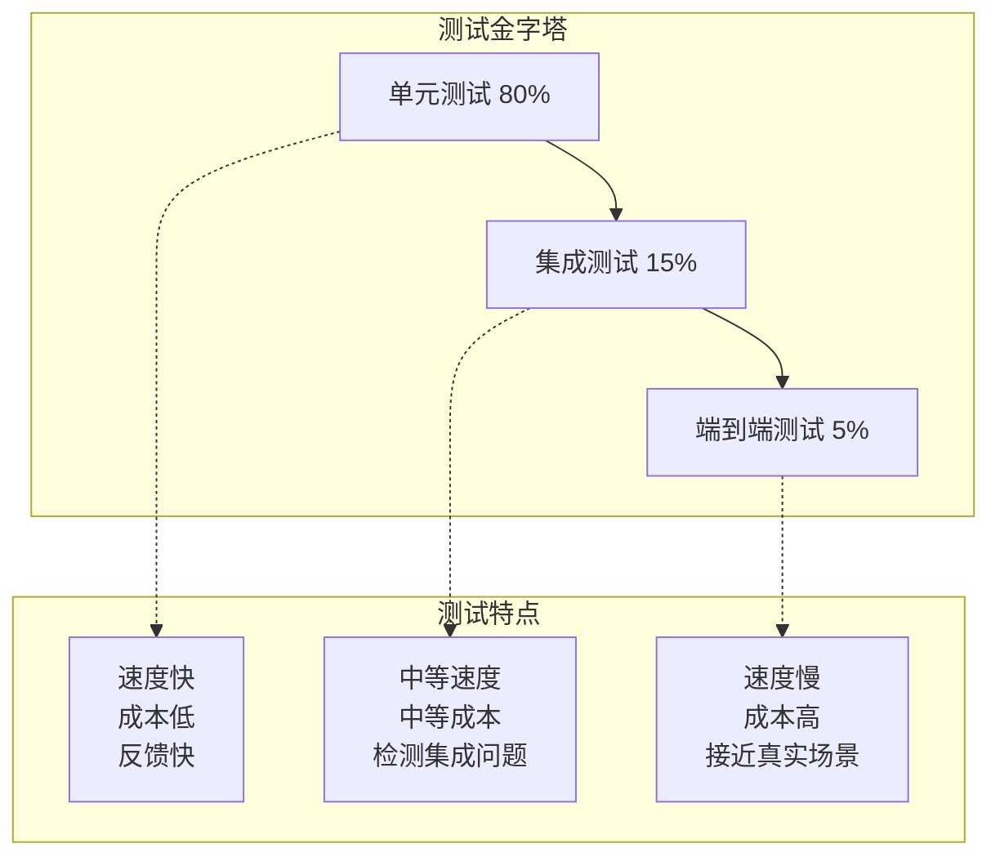
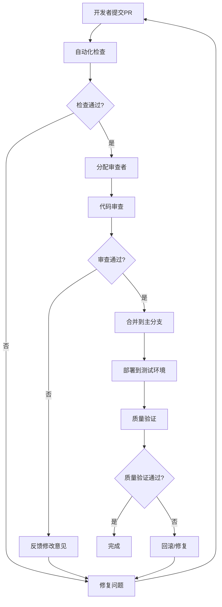

# 数字员工系统代码质量规范
## Digital Employee System Code Quality Standards v1.0

### 📋 文档信息
- **文档版本**: v1.0
- **创建日期**: 2024-01-24
- **适用范围**: 数字员工系统所有代码开发工作
- **维护部门**: 代码质量委员会

---

## 🎯 代码质量目标

### 1.1 质量指标体系

#### 1.1.1 核心质量指标

| 指标类别 | 指标名称 | 目标值 | 最低要求 | 检查工具 |
|----------|----------|--------|----------|----------|
| **代码覆盖率** | 单元测试覆盖率 | ≥85% | ≥70% | pytest-cov |
| **代码覆盖率** | 集成测试覆盖率 | ≥70% | ≥60% | pytest-cov |
| **代码复杂度** | 圈复杂度 | ≤10 | ≤15 | radon, flake8 |
| **代码复杂度** | 认知复杂度 | ≤15 | ≤20 | cognitive-complexity |  
| **代码重复** | 重复代码率 | ≤5% | ≤10% | jscpd, radon |
| **代码规范** | PEP8合规率 | 100% | 100% | flake8, black |

#### 1.1.2 质量门禁标准

```yaml
# 质量门禁配置
quality_gates:
  # 阻塞级别 - 必须通过
  blocking:
    - name: "单元测试通过率"
      threshold: "100%"
      
    - name: "代码覆盖率"
      threshold: "≥70%"
      
    - name: "代码规范检查"
      threshold: "0 violations"
      
    - name: "安全漏洞扫描"  
      threshold: "0 high severity"
      
  # 警告级别 - 影响评分
  warning:
    - name: "圈复杂度"
      threshold: "≤15"
      
    - name: "重复代码率"
      threshold: "≤10%"
      
    - name: "代码注释率"
      threshold: "≥60%"
```

### 1.2 质量评估体系

#### 1.2.1 代码质量评分算法

```python
# 代码质量评分算法
def calculate_code_quality_score(metrics: Dict[str, Any]) -> float:
    """
    计算代码质量综合评分
    
    Args:
        metrics: 代码质量指标字典
        
    Returns:
        float: 质量评分 (0-100)
    """
    weights = {
        'test_coverage': 0.25,      # 测试覆盖率 25%
        'code_complexity': 0.20,    # 代码复杂度 20%
        'code_duplication': 0.15,   # 代码重复率 15%
        'code_style': 0.15,         # 代码规范 15%
        'maintainability': 0.15,    # 可维护性 15%
        'security': 0.10            # 安全性 10%
    }
    
    scores = {}
    
    # 测试覆盖率评分
    coverage = metrics.get('test_coverage', 0)
    scores['test_coverage'] = min(100, coverage * 1.2)  # 85%以上得满分
    
    # 复杂度评分(反向指标)
    complexity = metrics.get('average_complexity', 0)
    scores['code_complexity'] = max(0, 100 - (complexity - 5) * 10)
    
    # 重复率评分(反向指标)
    duplication = metrics.get('duplication_rate', 0)
    scores['code_duplication'] = max(0, 100 - duplication * 10)
    
    # 代码规范评分
    style_violations = metrics.get('style_violations', 0)
    scores['code_style'] = max(0, 100 - style_violations)
    
    # 可维护性评分
    maintainability = metrics.get('maintainability_index', 50)
    scores['maintainability'] = maintainability
    
    # 安全性评分
    security_issues = metrics.get('security_issues', 0)
    scores['security'] = max(0, 100 - security_issues * 20)
    
    # 加权计算总分
    total_score = sum(scores[key] * weights[key] for key in weights)
    
    return round(total_score, 2)

# 质量等级划分
def get_quality_grade(score: float) -> str:
    """根据评分获取质量等级"""
    if score >= 90:
        return "A+ (优秀)"
    elif score >= 80:
        return "A (良好)"
    elif score >= 70:
        return "B (一般)"
    elif score >= 60:
        return "C (需改进)"
    else:
        return "D (不合格)"
```

---

## 📝 代码规范标准

### 2.1 Python代码规范

#### 2.1.1 PEP8扩展规范

```python
# .flake8 配置文件
[flake8]
max-line-length = 88
max-complexity = 10
ignore = 
    E203,  # whitespace before ':'
    E501,  # line too long (handled by black)
    W503,  # line break before binary operator
    F401   # imported but unused (handled by isort)
    
exclude = 
    .git,
    __pycache__,
    .venv,
    migrations,
    build,
    dist
    
per-file-ignores =
    __init__.py:F401
    tests/*:S101,S106

# 扩展检查
select = E,W,F,C,N
```

#### 2.1.2 类型注解规范

```python
# 类型注解标准示例
from typing import Dict, List, Optional, Union, Any, TypeVar, Generic
from datetime import datetime
from uuid import UUID

T = TypeVar('T')

class AgentService:
    """Agent服务类 - 类型注解示例"""
    
    def __init__(self, repository: 'AgentRepository') -> None:
        """初始化Agent服务
        
        Args:
            repository: Agent数据仓库
        """
        self._repository = repository
        self._cache: Dict[str, Any] = {}
    
    async def create_agent(
        self, 
        request: 'CreateAgentRequest',
        user_id: UUID
    ) -> 'AgentResponse':
        """创建Agent
        
        Args:
            request: 创建请求
            user_id: 用户ID
            
        Returns:
            AgentResponse: 创建的Agent信息
            
        Raises:
            AgentValidationError: 当Agent配置无效时
            DuplicationError: 当Agent名称重复时
        """
        # 实现逻辑
        pass
    
    async def get_agents(
        self,
        filters: Optional[Dict[str, Any]] = None,
        pagination: Optional['PaginationParams'] = None
    ) -> 'PaginatedResponse[AgentResponse]':
        """获取Agent列表
        
        Args:
            filters: 过滤条件
            pagination: 分页参数
            
        Returns:
            分页的Agent列表
        """
        pass
    
    def _validate_config(self, config: Dict[str, Any]) -> bool:
        """验证Agent配置
        
        Args:
            config: 配置字典
            
        Returns:
            bool: 配置是否有效
        """
        return True

# 复杂类型定义
AgentConfig = Dict[str, Union[str, int, bool, List[str]]]
AgentFilters = Dict[str, Union[str, int, List[str], datetime]]

# 泛型类示例
class Repository(Generic[T]):
    """通用数据仓库"""
    
    async def create(self, entity: T) -> T:
        """创建实体"""
        pass
    
    async def get_by_id(self, entity_id: UUID) -> Optional[T]:
        """根据ID获取实体"""
        pass
    
    async def update(self, entity_id: UUID, updates: Dict[str, Any]) -> Optional[T]:
        """更新实体"""
        pass
    
    async def delete(self, entity_id: UUID) -> bool:
        """删除实体"""
        pass
```

#### 2.1.3 异常处理规范

```python
# 异常处理标准
from typing import Type, Optional
import logging

logger = logging.getLogger(__name__)

class BaseException(Exception):
    """基础异常类"""
    
    def __init__(
        self, 
        message: str, 
        error_code: str = None,
        details: Dict[str, Any] = None
    ) -> None:
        self.message = message
        self.error_code = error_code
        self.details = details or {}
        super().__init__(message)

class ValidationError(BaseException):
    """数据验证异常"""
    
    def __init__(self, field: str, message: str, value: Any = None):
        super().__init__(
            message=f"字段 {field} 验证失败: {message}",
            error_code="VALIDATION_ERROR",
            details={"field": field, "value": value}
        )

# 异常处理装饰器
def handle_exceptions(
    default_return: Any = None,
    log_level: str = "ERROR",
    reraise: bool = True
):
    """异常处理装饰器"""
    def decorator(func):
        @functools.wraps(func)
        async def wrapper(*args, **kwargs):
            try:
                return await func(*args, **kwargs)
            except BaseException as e:
                # 业务异常，记录并重新抛出
                getattr(logger, log_level.lower())(
                    f"业务异常在 {func.__name__}: {e.message}",
                    extra={
                        "error_code": e.error_code,
                        "details": e.details
                    }
                )
                if reraise:
                    raise
                return default_return
            except Exception as e:
                # 系统异常，记录并包装
                logger.error(
                    f"系统异常在 {func.__name__}: {str(e)}",
                    exc_info=True
                )
                if reraise:
                    raise BaseException(
                        message="系统内部错误",
                        error_code="INTERNAL_ERROR"
                    ) from e
                return default_return
        return wrapper
    return decorator

# 使用示例
@handle_exceptions(default_return=None, reraise=True)
async def create_agent(request: CreateAgentRequest) -> AgentResponse:
    """创建Agent - 带异常处理"""
    
    # 数据验证
    if not request.agent_name:
        raise ValidationError("agent_name", "Agent名称不能为空")
    
    try:
        # 业务逻辑
        agent = await agent_repository.create(request)
        return AgentResponse.from_entity(agent)
    except DatabaseError as e:
        # 转换为业务异常
        raise BaseException(
            message="Agent创建失败",
            error_code="CREATION_FAILED",
            details={"database_error": str(e)}
        ) from e
```

### 2.2 代码组织规范

#### 2.2.1 项目结构标准

```
digital_employee_system/
├── src/                              # 源代码目录
│   ├── __init__.py
│   ├── main.py                       # 应用入口
│   ├── config/                       # 配置模块
│   │   ├── __init__.py
│   │   ├── settings.py               # 配置设置
│   │   └── database.py               # 数据库配置
│   ├── core/                         # 核心模块
│   │   ├── __init__.py
│   │   ├── dependencies.py           # 依赖注入
│   │   ├── exceptions.py             # 异常定义
│   │   └── security.py               # 安全相关
│   ├── models/                       # 数据模型
│   │   ├── __init__.py
│   │   ├── base.py                   # 基础模型
│   │   ├── agent.py                  # Agent模型
│   │   └── task.py                   # 任务模型
│   ├── schemas/                      # API模式
│   │   ├── __init__.py
│   │   ├── agent.py                  # Agent模式
│   │   └── task.py                   # 任务模式
│   ├── repositories/                 # 数据访问层
│   │   ├── __init__.py
│   │   ├── base.py                   # 基础仓库
│   │   ├── agent.py                  # Agent仓库
│   │   └── task.py                   # 任务仓库
│   ├── services/                     # 业务逻辑层
│   │   ├── __init__.py
│   │   ├── agent.py                  # Agent服务
│   │   └── task.py                   # 任务服务
│   ├── api/                          # API路由
│   │   ├── __init__.py
│   │   ├── v1/                       # API版本1
│   │   │   ├── __init__.py
│   │   │   ├── agents.py             # Agent接口
│   │   │   └── tasks.py              # 任务接口
│   │   └── middleware/               # 中间件
│   │       ├── __init__.py
│   │       ├── auth.py               # 认证中间件
│   │       └── logging.py            # 日志中间件
│   └── utils/                        # 工具模块
│       ├── __init__.py
│       ├── datetime.py               # 时间工具
│       ├── security.py               # 安全工具
│       └── validators.py             # 验证器
├── tests/                            # 测试目录
│   ├── __init__.py
│   ├── conftest.py                   # pytest配置
│   ├── unit/                         # 单元测试
│   │   ├── test_services/
│   │   └── test_repositories/
│   ├── integration/                  # 集成测试
│   │   ├── test_api/
│   │   └── test_database/
│   └── e2e/                          # 端到端测试
├── migrations/                       # 数据库迁移
├── docs/                             # 文档目录
├── scripts/                          # 脚本目录
├── requirements/                     # 依赖文件
│   ├── base.txt                      # 基础依赖
│   ├── development.txt               # 开发依赖
│   └── production.txt                # 生产依赖
├── .github/                          # GitHub配置
│   └── workflows/                    # CI/CD工作流
├── docker/                           # Docker配置
├── pyproject.toml                    # 项目配置
├── .pre-commit-config.yaml           # 代码检查配置
└── README.md                         # 项目说明
```

#### 2.2.2 模块导入规范

```python
# 导入顺序标准 (isort配置)
# 1. 标准库导入
import os
import sys
from datetime import datetime
from typing import Dict, List, Optional
from uuid import UUID

# 2. 第三方库导入
import uvicorn
from fastapi import FastAPI, Depends, HTTPException
from pydantic import BaseModel, Field
from sqlalchemy import Column, String, DateTime
from sqlalchemy.ext.asyncio import AsyncSession

# 3. 本地应用导入
from src.core.config import settings
from src.core.database import get_db_session
from src.models.agent import Agent
from src.schemas.agent import AgentCreate, AgentResponse
from src.services.agent import AgentService

# isort配置
[tool.isort]
profile = "black"
multi_line_output = 3
line_length = 88
known_first_party = ["src"]
known_third_party = ["fastapi", "pydantic", "sqlalchemy"]
sections = ["FUTURE", "STDLIB", "THIRDPARTY", "FIRSTPARTY", "LOCALFOLDER"]
```

---

## 🧪 测试质量标准

### 3.1 测试分层策略

#### 3.1.1 测试金字塔



#### 3.1.2 测试覆盖率要求

```yaml
# 测试覆盖率配置
coverage_requirements:
  overall: 85%           # 整体覆盖率
  
  by_module:
    services: 90%        # 业务逻辑层
    repositories: 85%    # 数据访问层
    models: 70%          # 数据模型
    utils: 80%           # 工具模块
    api: 75%             # API接口
    
  by_test_type:
    unit_tests: 80%      # 单元测试覆盖率
    integration_tests: 70% # 集成测试覆盖率
    
  exclusions:
    - "*/migrations/*"   # 数据库迁移
    - "*/tests/*"        # 测试代码本身
    - "*/venv/*"         # 虚拟环境
    - "*/build/*"        # 构建输出
```

#### 3.1.3 单元测试标准

```python
# 单元测试标准示例
import pytest
from unittest.mock import Mock, AsyncMock, patch
from uuid import uuid4
from datetime import datetime

from src.services.agent import AgentService
from src.repositories.agent import AgentRepository
from src.schemas.agent import CreateAgentRequest, AgentResponse
from src.models.agent import Agent
from src.core.exceptions import ValidationError, NotFoundError

class TestAgentService:
    """Agent服务单元测试"""
    
    @pytest.fixture
    def mock_repository(self):
        """Mock的Agent仓库"""
        return AsyncMock(spec=AgentRepository)
    
    @pytest.fixture
    def agent_service(self, mock_repository):
        """Agent服务实例"""
        return AgentService(repository=mock_repository)
    
    @pytest.fixture
    def sample_agent(self):
        """示例Agent数据"""
        return Agent(
            agent_id=uuid4(),
            agent_type="hr_agent",
            agent_name="HR助手",
            config={"max_tasks": 10},
            created_at=datetime.utcnow(),
            created_by=uuid4()
        )
    
    @pytest.fixture
    def create_request(self):
        """创建Agent请求"""
        return CreateAgentRequest(
            agent_type="hr_agent",
            agent_name="HR助手",
            config={"max_tasks": 10}
        )
    
    async def test_create_agent_success(
        self, 
        agent_service, 
        mock_repository, 
        create_request, 
        sample_agent
    ):
        """测试成功创建Agent"""
        # Given
        mock_repository.create.return_value = sample_agent
        
        # When
        result = await agent_service.create_agent(create_request, uuid4())
        
        # Then
        assert isinstance(result, AgentResponse)
        assert result.agent_name == "HR助手"
        assert result.agent_type == "hr_agent"
        mock_repository.create.assert_called_once()
    
    async def test_create_agent_validation_error(
        self, 
        agent_service, 
        mock_repository
    ):
        """测试创建Agent时验证错误"""
        # Given
        invalid_request = CreateAgentRequest(
            agent_type="",  # 无效的agent_type
            agent_name="HR助手"
        )
        
        # When & Then
        with pytest.raises(ValidationError) as exc_info:
            await agent_service.create_agent(invalid_request, uuid4())
        
        assert "agent_type" in str(exc_info.value)
        mock_repository.create.assert_not_called()
    
    async def test_get_agent_not_found(
        self, 
        agent_service, 
        mock_repository
    ):
        """测试获取不存在的Agent"""
        # Given
        agent_id = uuid4()
        mock_repository.get_by_id.return_value = None
        
        # When & Then
        with pytest.raises(NotFoundError):
            await agent_service.get_agent(agent_id)
        
        mock_repository.get_by_id.assert_called_once_with(agent_id)
    
    @pytest.mark.parametrize("agent_type,expected_config", [
        ("hr_agent", {"max_tasks": 10, "timeout": 300}),
        ("finance_agent", {"max_tasks": 5, "timeout": 600}),
        ("coding_agent", {"max_tasks": 1, "timeout": 1800}),
    ])
    async def test_get_default_config(
        self, 
        agent_service, 
        agent_type, 
        expected_config
    ):
        """测试不同Agent类型的默认配置"""
        # When
        config = agent_service.get_default_config(agent_type)
        
        # Then
        assert config == expected_config
    
    async def test_update_agent_config(
        self, 
        agent_service, 
        mock_repository, 
        sample_agent
    ):
        """测试更新Agent配置"""
        # Given
        agent_id = sample_agent.agent_id
        new_config = {"max_tasks": 20, "timeout": 400}
        updated_agent = Agent(**{**sample_agent.__dict__, "config": new_config})
        
        mock_repository.get_by_id.return_value = sample_agent
        mock_repository.update.return_value = updated_agent
        
        # When
        result = await agent_service.update_config(agent_id, new_config)
        
        # Then
        assert result.config == new_config
        mock_repository.update.assert_called_once_with(
            agent_id, 
            {"config": new_config}
        )

# 集成测试示例
@pytest.mark.integration
class TestAgentAPI:
    """Agent API集成测试"""
    
    @pytest.fixture
    async def client(self):
        """测试客户端"""
        from httpx import AsyncClient
        from src.main import app
        
        async with AsyncClient(app=app, base_url="http://test") as client:
            yield client
    
    @pytest.fixture
    def auth_headers(self):
        """认证头"""
        return {"Authorization": "Bearer test-token"}
    
    async def test_create_agent_api(self, client, auth_headers):
        """测试创建Agent API"""
        # Given
        request_data = {
            "agent_type": "hr_agent",
            "agent_name": "HR助手",
            "config": {"max_tasks": 10}
        }
        
        # When
        response = await client.post(
            "/api/v1/agents",
            json=request_data,
            headers=auth_headers
        )
        
        # Then
        assert response.status_code == 201
        data = response.json()
        assert data["success"] is True
        assert data["data"]["agent_name"] == "HR助手"
    
    async def test_get_agents_with_filters(self, client, auth_headers):
        """测试带过滤条件的Agent列表查询"""
        # When
        response = await client.get(
            "/api/v1/agents?status=active&agent_type=hr_agent",
            headers=auth_headers
        )
        
        # Then
        assert response.status_code == 200
        data = response.json()
        assert "items" in data["data"]
        assert "pagination" in data["data"]
```

### 3.2 测试工具配置

#### 3.2.1 pytest配置

```python
# conftest.py - pytest全局配置
import pytest
import asyncio
from typing import AsyncGenerator
from httpx import AsyncClient
from sqlalchemy.ext.asyncio import AsyncSession, create_async_engine
from sqlalchemy.pool import StaticPool

from src.main import app
from src.core.database import get_db_session
from src.models.base import Base

# 异步测试配置
@pytest.fixture(scope="session")
def event_loop():
    """创建事件循环"""
    loop = asyncio.get_event_loop_policy().new_event_loop()
    yield loop
    loop.close()

# 测试数据库配置
@pytest.fixture(scope="session")
async def test_engine():
    """测试数据库引擎"""
    engine = create_async_engine(
        "sqlite+aiosqlite:///:memory:",
        echo=False,
        poolclass=StaticPool,
        connect_args={"check_same_thread": False}
    )
    
    async with engine.begin() as conn:
        await conn.run_sync(Base.metadata.create_all)
    
    yield engine
    await engine.dispose()

@pytest.fixture
async def test_session(test_engine) -> AsyncGenerator[AsyncSession, None]:
    """测试数据库会话"""
    async with AsyncSession(test_engine) as session:
        yield session
        await session.rollback()

@pytest.fixture
async def client(test_session) -> AsyncGenerator[AsyncClient, None]:
    """测试客户端"""
    def override_get_db():
        return test_session
    
    app.dependency_overrides[get_db_session] = override_get_db
    
    async with AsyncClient(app=app, base_url="http://test") as client:
        yield client
    
    app.dependency_overrides.clear()

# 数据工厂
@pytest.fixture
def agent_factory():
    """Agent数据工厂"""
    def _create_agent(**kwargs):
        defaults = {
            "agent_id": uuid4(),
            "agent_type": "hr_agent",
            "agent_name": "测试Agent",
            "config": {"max_tasks": 10},
            "created_at": datetime.utcnow(),
            "created_by": uuid4()
        }
        defaults.update(kwargs)
        return Agent(**defaults)
    
    return _create_agent
```

#### 3.2.2 覆盖率配置

```toml
# pyproject.toml - 覆盖率配置
[tool.coverage.run]
source = ["src"]
branch = true
omit = [
    "*/tests/*",
    "*/migrations/*",
    "*/venv/*",
    "*/build/*",
    "*/__pycache__/*"
]

[tool.coverage.report]
exclude_lines = [
    "pragma: no cover",
    "def __repr__",
    "raise AssertionError",
    "raise NotImplementedError",
    "if __name__ == .__main__.:",
    "@abstract"
]

show_missing = true
skip_covered = false
precision = 2

[tool.coverage.html]
directory = "htmlcov"

[tool.coverage.xml]
output = "coverage.xml"
```

---

## 🔍 代码审查规范

### 4.1 代码审查流程

#### 4.1.1 审查流程图



#### 4.1.2 审查检查清单

```yaml
# 代码审查检查清单
code_review_checklist:
  功能性:
    - question: "代码实现是否符合需求?"
      weight: high
    - question: "边界条件是否处理正确?"
      weight: high
    - question: "错误处理是否完整?"
      weight: high
      
  可读性:
    - question: "代码逻辑是否清晰?"
      weight: medium
    - question: "命名是否有意义?"
      weight: medium
    - question: "注释是否必要且准确?"
      weight: medium
      
  可维护性:
    - question: "代码是否遵循SOLID原则?"
      weight: high
    - question: "是否有重复代码?"
      weight: medium
    - question: "依赖关系是否合理?"
      weight: medium
      
  性能:
    - question: "是否存在性能瓶颈?"
      weight: medium
    - question: "内存使用是否合理?"
      weight: low
    - question: "算法复杂度是否可接受?"
      weight: medium
      
  安全性:
    - question: "是否有安全漏洞?"
      weight: high
    - question: "输入验证是否充分?"
      weight: high
    - question: "敏感信息是否正确处理?"
      weight: high
      
  测试:
    - question: "测试用例是否充分?"
      weight: high
    - question: "测试覆盖率是否达标?"
      weight: high
    - question: "边界测试是否完整?"
      weight: medium
```

#### 4.1.3 审查反馈模板

```markdown
# 代码审查反馈模板

## 总体评价
- [ ] 批准 (Approved)
- [ ] 条件批准 (Approved with minor comments)
- [ ] 需要修改 (Request changes)

## 详细反馈

### 🔴 必须修改 (Must Fix)
- [ ] **安全问题**: 在第123行，用户输入没有进行SQL注入防护
- [ ] **功能缺陷**: 第456行的错误处理逻辑不正确

### 🟡 建议修改 (Should Fix)
- [ ] **性能优化**: 第78行的循环可以使用列表推导式优化
- [ ] **代码规范**: 第90行违反了PEP8命名规范

### 🟢 可选修改 (Could Fix)
- [ ] **代码风格**: 考虑将第200-250行的长函数拆分
- [ ] **文档完善**: 建议为complex_algorithm函数添加文档字符串

### ✅ 良好实践 (Good Practices)
- 错误处理很完善
- 测试用例覆盖全面
- 类型注解使用正确

## 学习建议
- 推荐阅读《Clean Code》关于函数设计的章节
- 建议了解Python的上下文管理器用法

## 评分
- 功能性: 8/10
- 代码质量: 7/10
- 测试质量: 9/10
- 整体评分: 8/10
```

### 4.2 自动化审查工具

#### 4.2.1 Pre-commit配置

```yaml
# .pre-commit-config.yaml
repos:
  - repo: https://github.com/pre-commit/pre-commit-hooks
    rev: v4.4.0
    hooks:
      - id: trailing-whitespace
      - id: end-of-file-fixer
      - id: check-yaml
      - id: check-added-large-files
      - id: check-merge-conflict
      
  - repo: https://github.com/psf/black
    rev: 22.10.0
    hooks:
      - id: black
        language_version: python3.11
        
  - repo: https://github.com/pycqa/isort
    rev: 5.12.0
    hooks:
      - id: isort
        args: ["--profile", "black"]
        
  - repo: https://github.com/pycqa/flake8
    rev: 6.0.0
    hooks:
      - id: flake8
        additional_dependencies:
          - flake8-docstrings
          - flake8-bugbear
          - flake8-comprehensions
          
  - repo: https://github.com/pre-commit/mirrors-mypy
    rev: v1.0.0
    hooks:
      - id: mypy
        additional_dependencies: [types-all]
        
  - repo: https://github.com/PyCQA/bandit
    rev: 1.7.4
    hooks:
      - id: bandit
        args: ["-r", "src/"]
        exclude: ^tests/
        
  - repo: https://github.com/pycqa/pydocstyle
    rev: 6.3.0
    hooks:
      - id: pydocstyle
        match: ^src/.*\.py$
```

#### 4.2.2 GitHub Actions CI配置

```yaml
# .github/workflows/ci.yml
name: CI

on:
  push:
    branches: [main, develop]
  pull_request:
    branches: [main, develop]

jobs:
  test:
    runs-on: ubuntu-latest
    strategy:
      matrix:
        python-version: [3.11]
        
    steps:
    - uses: actions/checkout@v3
    
    - name: Set up Python ${{ matrix.python-version }}
      uses: actions/setup-python@v4
      with:
        python-version: ${{ matrix.python-version }}
        
    - name: Install dependencies
      run: |
        python -m pip install --upgrade pip
        pip install -r requirements/development.txt
        
    - name: Run pre-commit
      run: pre-commit run --all-files
      
    - name: Run tests with coverage
      run: |
        pytest --cov=src --cov-report=xml --cov-report=html
        
    - name: Upload coverage to Codecov
      uses: codecov/codecov-action@v3
      with:
        file: ./coverage.xml
        fail_ci_if_error: true
        
    - name: Run security scan
      run: |
        bandit -r src/ -f json -o bandit-report.json
        
    - name: Run complexity analysis
      run: |
        radon cc src/ --min B
        radon mi src/ --min B
        
  quality-gate:
    needs: test
    runs-on: ubuntu-latest
    
    steps:
    - uses: actions/checkout@v3
    
    - name: Quality Gate
      run: |
        # 检查覆盖率
        coverage_threshold=80
        current_coverage=$(python -c "import xml.etree.ElementTree as ET; tree = ET.parse('coverage.xml'); root = tree.getroot(); print(int(float(root.attrib['line-rate']) * 100))")
        
        if [ "$current_coverage" -lt "$coverage_threshold" ]; then
          echo "Coverage $current_coverage% is below threshold $coverage_threshold%"
          exit 1
        fi
        
        echo "Quality gate passed!"
```

---

## 📊 代码质量监控

### 5.1 质量指标收集

#### 5.1.1 指标收集脚本

```python
# scripts/collect_quality_metrics.py
"""代码质量指标收集脚本"""

import json
import subprocess
import sys
from pathlib import Path
from typing import Dict, Any
import xml.etree.ElementTree as ET

class QualityMetricsCollector:
    """代码质量指标收集器"""
    
    def __init__(self, source_path: str = "src"):
        self.source_path = source_path
        self.metrics = {}
    
    def collect_all_metrics(self) -> Dict[str, Any]:
        """收集所有质量指标"""
        self.metrics.update({
            "coverage": self._collect_coverage_metrics(),
            "complexity": self._collect_complexity_metrics(),
            "style": self._collect_style_metrics(),
            "security": self._collect_security_metrics(),
            "duplication": self._collect_duplication_metrics(),
            "maintainability": self._collect_maintainability_metrics()
        })
        
        # 计算综合评分
        self.metrics["overall_score"] = self._calculate_overall_score()
        
        return self.metrics
    
    def _collect_coverage_metrics(self) -> Dict[str, float]:
        """收集测试覆盖率指标"""
        try:
            # 运行coverage
            subprocess.run(["coverage", "run", "-m", "pytest"], check=True)
            subprocess.run(["coverage", "xml"], check=True)
            
            # 解析coverage.xml
            tree = ET.parse("coverage.xml")
            root = tree.getroot()
            
            return {
                "line_coverage": float(root.attrib.get("line-rate", 0)) * 100,
                "branch_coverage": float(root.attrib.get("branch-rate", 0)) * 100,
                "lines_covered": int(root.attrib.get("lines-covered", 0)),
                "lines_valid": int(root.attrib.get("lines-valid", 0))
            }
        except Exception as e:
            print(f"收集覆盖率指标失败: {e}")
            return {"line_coverage": 0, "branch_coverage": 0}
    
    def _collect_complexity_metrics(self) -> Dict[str, float]:
        """收集复杂度指标"""
        try:
            # 运行radon
            result = subprocess.run(
                ["radon", "cc", self.source_path, "--json"],
                capture_output=True, text=True, check=True
            )
            
            complexity_data = json.loads(result.stdout)
            
            all_complexities = []
            for file_data in complexity_data.values():
                for item in file_data:
                    if "complexity" in item:
                        all_complexities.append(item["complexity"])
            
            if all_complexities:
                return {
                    "average_complexity": sum(all_complexities) / len(all_complexities),
                    "max_complexity": max(all_complexities),
                    "high_complexity_count": len([c for c in all_complexities if c > 10])
                }
            
            return {"average_complexity": 0, "max_complexity": 0}
        except Exception as e:
            print(f"收集复杂度指标失败: {e}")
            return {"average_complexity": 0, "max_complexity": 0}
    
    def _collect_style_metrics(self) -> Dict[str, int]:
        """收集代码风格指标"""
        try:
            result = subprocess.run(
                ["flake8", self.source_path, "--format=json"],
                capture_output=True, text=True
            )
            
            violations = []
            if result.stdout:
                violations = json.loads(result.stdout)
            
            return {
                "total_violations": len(violations),
                "error_count": len([v for v in violations if v["code"].startswith("E")]),
                "warning_count": len([v for v in violations if v["code"].startswith("W")])
            }
        except Exception as e:
            print(f"收集风格指标失败: {e}")
            return {"total_violations": 0}
    
    def _collect_security_metrics(self) -> Dict[str, int]:
        """收集安全指标"""
        try:
            result = subprocess.run(
                ["bandit", "-r", self.source_path, "-f", "json"],
                capture_output=True, text=True
            )
            
            security_data = json.loads(result.stdout)
            
            return {
                "high_severity_issues": len([
                    issue for issue in security_data.get("results", [])
                    if issue.get("issue_severity") == "HIGH"
                ]),
                "medium_severity_issues": len([
                    issue for issue in security_data.get("results", [])
                    if issue.get("issue_severity") == "MEDIUM"
                ]),
                "total_issues": len(security_data.get("results", []))
            }
        except Exception as e:
            print(f"收集安全指标失败: {e}")
            return {"total_issues": 0}
    
    def _collect_duplication_metrics(self) -> Dict[str, float]:
        """收集重复代码指标"""
        try:
            result = subprocess.run(
                ["jscpd", self.source_path, "--reporters", "json"],
                capture_output=True, text=True
            )
            
            if result.stdout:
                duplication_data = json.loads(result.stdout)
                statistics = duplication_data.get("statistics", {})
                
                return {
                    "duplication_percentage": statistics.get("percentage", 0),
                    "duplicated_lines": statistics.get("duplicatedLines", 0),
                    "total_lines": statistics.get("totalLines", 0)
                }
            
            return {"duplication_percentage": 0}
        except Exception as e:
            print(f"收集重复代码指标失败: {e}")
            return {"duplication_percentage": 0}
    
    def _collect_maintainability_metrics(self) -> Dict[str, float]:
        """收集可维护性指标"""
        try:
            result = subprocess.run(
                ["radon", "mi", self.source_path, "--json"],
                capture_output=True, text=True, check=True
            )
            
            mi_data = json.loads(result.stdout)
            
            all_mi_scores = []
            for file_data in mi_data.values():
                if "mi" in file_data:
                    all_mi_scores.append(file_data["mi"])
            
            if all_mi_scores:
                return {
                    "average_maintainability": sum(all_mi_scores) / len(all_mi_scores),
                    "min_maintainability": min(all_mi_scores)
                }
            
            return {"average_maintainability": 0}
        except Exception as e:
            print(f"收集可维护性指标失败: {e}")
            return {"average_maintainability": 0}
    
    def _calculate_overall_score(self) -> float:
        """计算综合质量评分"""
        weights = {
            "coverage": 0.3,
            "complexity": 0.2,
            "style": 0.15,
            "security": 0.2,
            "duplication": 0.1,
            "maintainability": 0.05
        }
        
        scores = {}
        
        # 覆盖率评分
        coverage = self.metrics.get("coverage", {}).get("line_coverage", 0)
        scores["coverage"] = min(100, coverage * 1.2)
        
        # 复杂度评分(反向)
        avg_complexity = self.metrics.get("complexity", {}).get("average_complexity", 0)
        scores["complexity"] = max(0, 100 - (avg_complexity - 5) * 10)
        
        # 风格评分(反向)
        violations = self.metrics.get("style", {}).get("total_violations", 0)
        scores["style"] = max(0, 100 - violations * 2)
        
        # 安全评分(反向)
        security_issues = self.metrics.get("security", {}).get("total_issues", 0)
        scores["security"] = max(0, 100 - security_issues * 10)
        
        # 重复率评分(反向)
        duplication = self.metrics.get("duplication", {}).get("duplication_percentage", 0)
        scores["duplication"] = max(0, 100 - duplication * 5)
        
        # 可维护性评分
        maintainability = self.metrics.get("maintainability", {}).get("average_maintainability", 50)
        scores["maintainability"] = maintainability
        
        # 加权计算
        total_score = sum(scores[key] * weights[key] for key in weights if key in scores)
        
        return round(total_score, 2)
    
    def generate_report(self) -> str:
        """生成质量报告"""
        report = f"""
# 代码质量报告

## 综合评分: {self.metrics.get('overall_score', 0):.1f}/100

## 详细指标

### 测试覆盖率
- 行覆盖率: {self.metrics.get('coverage', {}).get('line_coverage', 0):.1f}%
- 分支覆盖率: {self.metrics.get('coverage', {}).get('branch_coverage', 0):.1f}%

### 代码复杂度
- 平均复杂度: {self.metrics.get('complexity', {}).get('average_complexity', 0):.1f}
- 最大复杂度: {self.metrics.get('complexity', {}).get('max_complexity', 0)}

### 代码风格
- 总违规数: {self.metrics.get('style', {}).get('total_violations', 0)}
- 错误数: {self.metrics.get('style', {}).get('error_count', 0)}
- 警告数: {self.metrics.get('style', {}).get('warning_count', 0)}

### 安全性
- 高危问题: {self.metrics.get('security', {}).get('high_severity_issues', 0)}
- 中危问题: {self.metrics.get('security', {}).get('medium_severity_issues', 0)}
- 总问题数: {self.metrics.get('security', {}).get('total_issues', 0)}

### 代码重复
- 重复率: {self.metrics.get('duplication', {}).get('duplication_percentage', 0):.1f}%

### 可维护性
- 平均可维护性指数: {self.metrics.get('maintainability', {}).get('average_maintainability', 0):.1f}
        """
        
        return report

if __name__ == "__main__":
    collector = QualityMetricsCollector()
    metrics = collector.collect_all_metrics()
    
    # 保存指标数据
    with open("quality_metrics.json", "w") as f:
        json.dump(metrics, f, indent=2)
    
    # 生成报告
    report = collector.generate_report()
    with open("quality_report.md", "w") as f:
        f.write(report)
    
    print("质量指标收集完成!")
    print(f"综合评分: {metrics['overall_score']:.1f}/100")
```

### 5.2 质量趋势分析

#### 5.2.1 质量趋势图表

```python
# scripts/quality_trend_analysis.py
"""质量趋势分析脚本"""

import json
import matplotlib.pyplot as plt
import pandas as pd
from datetime import datetime, timedelta
from pathlib import Path

class QualityTrendAnalyzer:
    """质量趋势分析器"""
    
    def __init__(self, data_path: str = "quality_history"):
        self.data_path = Path(data_path)
        self.data_path.mkdir(exist_ok=True)
    
    def save_current_metrics(self, metrics: Dict[str, Any]):
        """保存当前质量指标"""
        timestamp = datetime.now().isoformat()
        filename = f"metrics_{timestamp}.json"
        
        with open(self.data_path / filename, "w") as f:
            json.dump({
                "timestamp": timestamp,
                "metrics": metrics
            }, f, indent=2)
    
    def load_historical_data(self) -> pd.DataFrame:
        """加载历史数据"""
        data = []
        
        for file_path in self.data_path.glob("metrics_*.json"):
            with open(file_path) as f:
                record = json.load(f)
                
            row = {
                "timestamp": pd.to_datetime(record["timestamp"]),
                "overall_score": record["metrics"].get("overall_score", 0),
                "coverage": record["metrics"].get("coverage", {}).get("line_coverage", 0),
                "complexity": record["metrics"].get("complexity", {}).get("average_complexity", 0),
                "violations": record["metrics"].get("style", {}).get("total_violations", 0),
                "security_issues": record["metrics"].get("security", {}).get("total_issues", 0)
            }
            data.append(row)
        
        df = pd.DataFrame(data)
        return df.sort_values("timestamp")
    
    def generate_trend_charts(self):
        """生成趋势图表"""
        df = self.load_historical_data()
        
        if df.empty:
            print("没有历史数据可用于生成趋势图")
            return
        
        # 创建子图
        fig, axes = plt.subplots(2, 2, figsize=(15, 10))
        fig.suptitle("代码质量趋势分析", fontsize=16)
        
        # 综合评分趋势
        axes[0, 0].plot(df["timestamp"], df["overall_score"], marker="o")
        axes[0, 0].set_title("综合质量评分趋势")
        axes[0, 0].set_ylabel("评分")
        axes[0, 0].grid(True)
        
        # 测试覆盖率趋势
        axes[0, 1].plot(df["timestamp"], df["coverage"], marker="s", color="green")
        axes[0, 1].set_title("测试覆盖率趋势")
        axes[0, 1].set_ylabel("覆盖率 (%)")
        axes[0, 1].grid(True)
        
        # 复杂度趋势
        axes[1, 0].plot(df["timestamp"], df["complexity"], marker="^", color="orange")
        axes[1, 0].set_title("平均复杂度趋势")
        axes[1, 0].set_ylabel("复杂度")
        axes[1, 0].grid(True)
        
        # 违规数趋势
        axes[1, 1].plot(df["timestamp"], df["violations"], marker="v", color="red")
        axes[1, 1].set_title("代码违规数趋势")
        axes[1, 1].set_ylabel("违规数")
        axes[1, 1].grid(True)
        
        # 调整布局
        plt.tight_layout()
        
        # 保存图表
        plt.savefig("quality_trends.png", dpi=300, bbox_inches="tight")
        plt.show()
    
    def generate_quality_report(self) -> str:
        """生成质量趋势报告"""
        df = self.load_historical_data()
        
        if len(df) < 2:
            return "历史数据不足，无法生成趋势报告"
        
        # 计算变化趋势
        latest = df.iloc[-1]
        previous = df.iloc[-2]
        
        score_change = latest["overall_score"] - previous["overall_score"]
        coverage_change = latest["coverage"] - previous["coverage"]
        
        report = f"""
# 代码质量趋势报告

## 最新数据 ({latest["timestamp"].strftime("%Y-%m-%d %H:%M")})
- 综合评分: {latest["overall_score"]:.1f} ({score_change:+.1f})
- 测试覆盖率: {latest["coverage"]:.1f}% ({coverage_change:+.1f}%)
- 平均复杂度: {latest["complexity"]:.1f}
- 代码违规: {latest["violations"]}个

## 趋势分析
- 质量评分{'上升' if score_change > 0 else '下降' if score_change < 0 else '保持稳定'}
- 测试覆盖率{'提高' if coverage_change > 0 else '降低' if coverage_change < 0 else '保持不变'}

## 建议
"""
        
        if score_change < -5:
            report += "- ⚠️ 质量评分显著下降，需要重点关注\n"
        
        if latest["coverage"] < 80:
            report += "- 📊 测试覆盖率低于目标值(80%)，需要补充测试\n"
        
        if latest["complexity"] > 10:
            report += "- 🔄 代码复杂度过高，考虑重构\n"
        
        if latest["violations"] > 50:
            report += "- 📝 代码违规较多，需要规范化\n"
        
        return report

if __name__ == "__main__":
    analyzer = QualityTrendAnalyzer()
    
    # 生成趋势图表
    analyzer.generate_trend_charts()
    
    # 生成趋势报告
    report = analyzer.generate_quality_report()
    
    with open("quality_trend_report.md", "w") as f:
        f.write(report)
    
    print("质量趋势分析完成!")
```

---

## 📋 质量检查清单

### 6.1 开发阶段检查

- [ ] **代码规范**
  - [ ] 遵循PEP8规范
  - [ ] 类型注解完整
  - [ ] 导入顺序正确
  - [ ] 命名规范统一

- [ ] **代码质量**
  - [ ] 函数长度合理(≤50行)
  - [ ] 圈复杂度可接受(≤10)
  - [ ] 无重复代码
  - [ ] 异常处理完整

- [ ] **测试覆盖**
  - [ ] 单元测试覆盖率≥80%
  - [ ] 边界条件测试
  - [ ] 异常路径测试
  - [ ] 集成测试完整

### 6.2 提交前检查

- [ ] **自动化检查**
  - [ ] Pre-commit钩子通过
  - [ ] 静态分析无问题
  - [ ] 安全扫描通过
  - [ ] 构建成功

- [ ] **手动检查**
  - [ ] 代码审查完成
  - [ ] 文档更新
  - [ ] 变更日志记录
  - [ ] 质量指标达标

---

**文档状态**: 正式发布  
**最后更新**: 2024-01-24  
**下次评审**: 2024-04-24  
**批准人**: 代码质量委员会