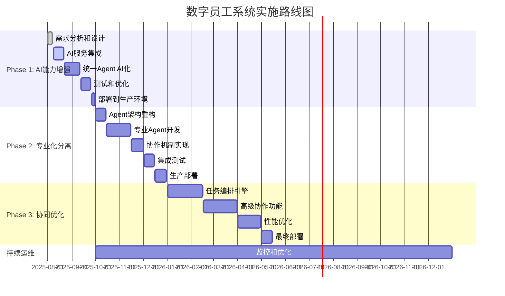

# 数字员工系统实施路线图

## 📋 执行摘要

基于前期的深入分析，我们制定了一个**渐进演进的实施路线图**，将在9-12个月内完成从当前MVP到AI增强协同系统的升级。

### 核心策略
- **务实路线**：基于现有代码基础，避免推倒重来
- **价值优先**：每个阶段都能独立交付业务价值
- **数据驱动**：基于实际使用数据决定后续演进方向
- **风险可控**：分阶段实施，每阶段都有回退方案

### 总体目标
- **3个月内**：AI能力显著提升，用户满意度>4.0/5.0
- **6个月内**：专业化Agent分离，开发效率提升80%
- **9个月内**：Agent协同初步实现，团队协作效率提升150%

---

## 🗺️ 实施路线图概览



---

## 🚀 Phase 1: AI能力增强 (3个月)

### 目标
将当前基于规则的系统升级为真正的AI驱动系统，显著提升响应质量。

### 关键交付物
- ✅ AI服务抽象层完整实现
- ✅ 统一Agent AI化改造完成
- ✅ 向量数据库集成（可选）
- ✅ 基础监控和质量评估体系
- ✅ 生产环境部署和验证

### 详细实施计划

#### Week 1-2: AI服务集成 (8月8日-8月21日)
**负责人**：后端技术负责人  
**预算**：15万元  

**Sprint 1: AI服务基础设施**
- [ ] 设计和实现AI服务抽象层
- [ ] OpenAI API集成和测试
- [ ] 错误处理和重试机制
- [ ] 基础监控指标定义

**关键任务**：
```python
# 核心交付代码
class OpenAIService(AIService):
    async def generate_response(self, request: AIRequest) -> AIResponse:
        # 实现重试、超时、监控等机制
        pass

class AIServiceFactory:
    @staticmethod
    def create_service(provider: str) -> AIService:
        # 工厂模式支持多厂商
        pass
```

**验收标准**：
- AI服务抽象层单元测试覆盖率>90%
- OpenAI API集成测试通过
- 错误处理机制验证完成
- Prometheus监控指标正常输出

#### Week 3-6: 统一Agent AI化改造 (8月22日-9月11日)
**负责人**：Agent开发负责人  
**预算**：25万元  

**Sprint 2: 需求分析AI化**
- [ ] 需求分析Agent AI化改造
- [ ] Prompt工程和优化
- [ ] 输出格式标准化
- [ ] 质量评估机制

**Sprint 3: 其他功能AI化**
- [ ] 方案设计Agent AI化
- [ ] 代码生成Agent AI化  
- [ ] 项目规划Agent AI化
- [ ] 统一的降级机制

**关键实现**：
```python
async def _analyze_requirement_ai(self, user_input: str) -> Dict[str, Any]:
    # 使用AI进行需求分析
    prompt = self._build_requirement_analysis_prompt(user_input)
    ai_response = await self.ai_service.generate_response(prompt)
    
    # 解析和验证AI响应
    result = self._parse_ai_response(ai_response)
    
    # 降级逻辑
    if result.confidence_score < 0.6:
        result = await self._fallback_to_rules(user_input)
    
    return result
```

**验收标准**：
- AI响应质量评估>75%
- 需求分析准确率>80%
- 响应时间<8秒（95%请求）
- 降级机制正常工作

#### Week 7-8: 质量优化和测试 (9月12日-9月25日)
**负责人**：QA工程师  
**预算**：10万元  

**Sprint 4: 质量保证**
- [ ] 完整的测试套件
- [ ] 性能基准测试
- [ ] 安全测试
- [ ] 用户体验测试

**测试覆盖**：
- 单元测试：覆盖率>85%
- 集成测试：核心流程100%覆盖
- 性能测试：1000并发用户场景
- 安全测试：OWASP Top 10检查

#### Phase 1 里程碑检查点

**成功标准**：
- ✅ **功能完整性**：所有原有功能AI化完成
- ✅ **性能指标**：响应时间<8秒，系统可用性>99%
- ✅ **质量指标**：用户满意度>4.0/5.0，准确率>80%
- ✅ **稳定性**：生产环境稳定运行2周无重大问题

**Go/No-Go决策**：
- 如果成功标准全部达到 → 进入Phase 2
- 如果部分达到 → 延期1个月，重点解决问题
- 如果大部分未达到 → 重新评估技术路线

---

## 🔄 Phase 2: 专业化分离 (3个月)

### 目标
基于Phase 1的使用数据，将统一Agent按需分离为专业化Agent，提升专业能力。

### 前置条件
- Phase 1成功完成
- 收集到足够的使用数据（>1000个任务）
- 用户反馈和需求明确

### 关键交付物
- ✅ 专业化Agent架构实现
- ✅ Agent注册和发现机制
- ✅ 简单的Agent协作机制
- ✅ 监控和性能优化
- ✅ 生产环境平滑升级

### 详细实施计划

#### Week 9-10: 数据分析和架构设计 (10月1日-10月14日)
**负责人**：架构师  
**预算**：12万元  

**Sprint 5: 数据驱动决策**
- [ ] 分析Phase 1使用数据
- [ ] 确定分离的Agent类型
- [ ] 设计Agent协作机制
- [ ] 性能基线建立

**数据分析重点**：
```python
# 分析要点
task_distribution = analyze_task_types()  # 任务类型分布
performance_metrics = analyze_response_times()  # 性能分析
user_feedback = analyze_satisfaction()  # 用户满意度
failure_patterns = analyze_failures()  # 失败模式

# 决策逻辑
if task_distribution['requirement_analysis'] > 40%:
    create_specialized_agent('RequirementAnalysisAgent')
```

#### Week 11-16: 专业Agent开发 (10月15日-11月15日)
**负责人**：Agent开发团队  
**预算**：40万元  

**Sprint 6-8: 专业Agent实现**
- [ ] RequirementAnalysisAgent专业化
- [ ] ArchitectureDesignAgent开发
- [ ] CodeGenerationAgent开发  
- [ ] Agent注册发现机制

**核心实现**：
```python
class RequirementAnalysisAgent(BaseAgent):
    def __init__(self):
        super().__init__(AgentMetadata(
            name="requirement_analysis_agent",
            capabilities=[
                AgentCapability("functional_requirement_extraction"),
                AgentCapability("non_functional_requirement_analysis")
            ]
        ))
    
    def can_handle(self, task_type: TaskType) -> float:
        if task_type == TaskType.REQUIREMENT_ANALYSIS:
            return 0.95  # 高置信度
        return 0.0
```

#### Week 17-18: 协作机制实现 (11月16日-12月1日)
**负责人**：系统架构师  
**预算**：18万元  

**Sprint 9: Agent协作**
- [ ] 顺序协作编排器
- [ ] Agent间消息传递
- [ ] 上下文共享机制
- [ ] 错误处理和恢复

**协作实现**：
```python
class SequentialOrchestrator:
    async def execute_workflow(self, workflow, request):
        context = request.context.copy()
        for step in workflow:
            agent = self.registry.get_agent(step.agent_name)
            result = await agent.process_task(
                self._transform_request(request, context, step)
            )
            context.update(result.context)
        return self._merge_results(workflow_results)
```

#### Phase 2 里程碑检查点

**成功标准**：
- ✅ **专业化效果**：专业Agent响应质量>统一Agent 20%
- ✅ **协作成功率**：Agent协作成功率>85%
- ✅ **性能提升**：整体处理效率提升50%
- ✅ **用户满意度**：>4.2/5.0

---

## 🤝 Phase 3: 协同优化 (4个月)

### 目标
实现Agent间的智能协同，支持复杂任务的自动分解和并行处理。

### 前置条件
- Phase 2成功完成
- Agent协作机制稳定运行
- 有复杂协作需求的实际场景

### 关键交付物
- ✅ 智能任务分解和分配
- ✅ 并行Agent协作支持
- ✅ 动态负载均衡
- ✅ 高级监控和自愈能力
- ✅ 企业级部署架构

### 详细实施计划

#### Week 19-24: 任务编排引擎 (1月1日-2月15日)
**负责人**：系统架构师  
**预算**：35万元  

**Sprint 10-12: 智能编排**
- [ ] 任务自动分解算法
- [ ] 并行执行引擎
- [ ] 动态调度优化
- [ ] 质量监控增强

**核心特性**：
```python
class IntelligentOrchestrator:
    async def execute_complex_task(self, task):
        # 任务智能分解
        subtasks = await self.decompose_task(task)
        
        # 并行执行规划
        execution_plan = self.plan_parallel_execution(subtasks)
        
        # 动态执行
        results = await self.execute_with_monitoring(execution_plan)
        
        return self.integrate_results(results)
```

#### Week 25-30: 高级协作功能 (2月16日-3月31日)
**负责人**：全栈开发团队  
**预算**：30万元  

**Sprint 13-15: 协作增强**
- [ ] Agent学习和适应机制
- [ ] 跨Agent上下文传递
- [ ] 协作质量评估
- [ ] 用户交互界面优化

#### Week 31-34: 性能优化和企业级部署 (4月1日-5月15日)
**负责人**：DevOps团队  
**预算**：25万元  

**Sprint 16-17: 生产就绪**
- [ ] 性能调优和扩展性优化
- [ ] Kubernetes集群部署
- [ ] 高可用架构实现
- [ ] 灾难恢复方案

#### Phase 3 里程碑检查点

**成功标准**：
- ✅ **协同效率**：复杂任务处理效率提升100%
- ✅ **系统可用性**：>99.9%
- ✅ **并发能力**：支持100+并发会话
- ✅ **用户满意度**：>4.5/5.0

---

## 📊 资源规划和预算

### 人力资源配置

#### Phase 1 团队 (3个月)
| 角色 | 人数 | 工作量 | 月薪 | 总成本 |
|------|------|--------|------|--------|
| 技术负责人 | 1 | 全职 | 4万 | 12万 |
| 后端开发工程师 | 2 | 全职 | 2.5万 | 15万 |
| AI工程师 | 1 | 全职 | 3万 | 9万 |
| QA工程师 | 1 | 全职 | 2万 | 6万 |
| DevOps工程师 | 1 | 兼职 | 2.5万 | 3.75万 |
| **小计** | **6人** | - | - | **45.75万** |

#### Phase 2 团队 (3个月)
| 角色 | 人数 | 工作量 | 月薪 | 总成本 |
|------|------|--------|------|--------|
| 系统架构师 | 1 | 全职 | 4.5万 | 13.5万 |
| 后端开发工程师 | 3 | 全职 | 2.5万 | 22.5万 |
| AI工程师 | 1 | 全职 | 3万 | 9万 |
| 前端开发工程师 | 1 | 全职 | 2.2万 | 6.6万 |
| QA工程师 | 1 | 全职 | 2万 | 6万 |
| DevOps工程师 | 1 | 全职 | 2.5万 | 7.5万 |
| **小计** | **8人** | - | - | **65.1万** |

#### Phase 3 团队 (4个月)
| 角色 | 人数 | 工作量 | 月薪 | 总成本 |
|------|------|--------|------|--------|
| 系统架构师 | 1 | 全职 | 4.5万 | 18万 |
| 后端开发工程师 | 3 | 全职 | 2.5万 | 30万 |
| AI工程师 | 2 | 全职 | 3万 | 24万 |
| 前端开发工程师 | 1 | 全职 | 2.2万 | 8.8万 |
| QA工程师 | 2 | 全职 | 2万 | 16万 |
| DevOps工程师 | 1 | 全职 | 2.5万 | 10万 |
| **小计** | **10人** | - | - | **106.8万** |

### 技术成本预算

#### 基础设施成本
| 项目 | Phase 1 | Phase 2 | Phase 3 | 年运营成本 |
|------|---------|---------|---------|------------|
| **云服务器** | 2万/月 | 3万/月 | 5万/月 | 36万 |
| **数据库** | 1万/月 | 1.5万/月 | 2万/月 | 18万 |
| **AI服务费用** | 5万/月 | 8万/月 | 12万/月 | 96万 |
| **监控工具** | 0.5万/月 | 0.8万/月 | 1万/月 | 9万 |
| **安全服务** | 1万/月 | 1.2万/月 | 1.5万/月 | 14万 |
| **CDN和存储** | 0.8万/月 | 1万/月 | 1.5万/月 | 12万 |
| **小计** | 10.3万/月 | 15.5万/月 | 23万/月 | **185万/年** |

#### 软件许可成本
| 项目 | 一次性成本 | 年度成本 |
|------|------------|----------|
| 企业级监控平台 | 15万 | 20万 |
| 安全扫描工具 | 8万 | 12万 |
| 开发工具许可 | 5万 | 8万 |
| **小计** | **28万** | **40万/年** |

### 总预算汇总

| 阶段 | 人力成本 | 基础设施成本 | 软件许可 | 其他费用 | **阶段总计** |
|------|----------|--------------|----------|----------|------------|
| **Phase 1** | 45.75万 | 30.9万 | 10万 | 5万 | **91.65万** |  
| **Phase 2** | 65.1万 | 46.5万 | 8万 | 8万 | **127.6万** |
| **Phase 3** | 106.8万 | 92万 | 10万 | 12万 | **220.8万** |
| **运营年1** | 120万 | 185万 | 40万 | 15万 | **360万** |
| **项目总计** | **337.65万** | **354.4万** | **68万** | **40万** | **800万** |

---

## 🎯 关键成功因素

### 1. 团队能力建设
- **AI技术培训**：团队需要掌握LLM应用开发技能
- **Agent架构理解**：深入理解Agent协作模式
- **质量意识提升**：建立AI系统质量保证意识
- **工具熟练度**：掌握现代化开发工具链

### 2. 技术风险管控
- **多厂商备份**：避免单一AI厂商依赖
- **性能监控**：建立完善的性能监控体系
- **成本控制**：严格控制AI服务调用成本
- **安全防护**：确保数据和系统安全

### 3. 业务价值验证
- **快速反馈**：每个阶段都要有用户反馈
- **价值量化**：建立可衡量的价值指标
- **持续优化**：基于数据持续改进系统
- **用户参与**：深度绑定核心用户

### 4. 组织变革管理
- **领导支持**：获得高层的持续支持
- **文化适应**：培养AI协作的工作文化
- **流程优化**：调整现有工作流程
- **激励机制**：建立鼓励创新的激励机制

---

## ⚠️ 风险识别和缓解策略

### 高风险项 (需要重点关注)

#### 1. AI服务依赖风险
**风险描述**：OpenAI等第三方服务不稳定或涨价  
**概率**：中  
**影响**：高  
**缓解策略**：
- 多厂商备份方案（OpenAI + Claude + 国产LLM）
- 成本监控和预算控制
- 本地化LLM备选方案研究

#### 2. 技术复杂度风险
**风险描述**：Agent协作机制比预期复杂，开发周期延长  
**概率**：中  
**影响**：高  
**缓解策略**：
- 分阶段实施，每阶段独立验证
- 保持简单有效的设计原则
- 充分的技术预研和原型验证

#### 3. 团队能力风险
**风险描述**：团队AI技术能力不足，影响交付质量  
**概率**：中  
**影响**：中  
**缓解策略**：
- 提前进行技术培训
- 引入有经验的AI工程师
- 与外部专家建立咨询关系

### 中等风险项

#### 4. 用户接受度风险
**风险描述**：用户对AI系统接受度不高  
**概率**：低  
**影响**：中  
**缓解策略**：
- 深度用户参与和反馈收集
- 渐进式功能发布
- 用户教育和培训

#### 5. 性能风险
**风险描述**：系统性能无法满足并发要求  
**概率**：低  
**影响**：中  
**缓解策略**：
- 充分的性能测试
- 可扩展的架构设计
- 性能监控和优化

### 风险监控机制
- **周度风险评估**：每周评估风险状态变化
- **里程碑风险审查**：每个阶段结束进行风险审查
- **应急响应计划**：制定具体的风险应对措施
- **经验教训总结**：及时总结和分享风险应对经验

---

## 📈 价值预期和ROI分析

### 量化价值指标

#### 效率提升
| 指标 | 当前状态 | Phase 1目标 | Phase 2目标 | Phase 3目标 |
|------|----------|-------------|-------------|-------------|
| **需求分析时间** | 4小时 | 2小时 | 1.5小时 | 1小时 |
| **方案设计时间** | 8小时 | 4小时 | 3小时 | 2小时 |
| **代码生成速度** | 手工 | 提示生成 | 自动生成框架 | 智能代码助手 |
| **项目规划准确率** | 60% | 75% | 85% | 90% |

#### 质量提升
| 指标 | 当前状态 | Phase 1目标 | Phase 2目标 | Phase 3目标 |
|------|----------|-------------|-------------|-------------|
| **需求理解准确率** | 65% | 80% | 85% | 90% |
| **用户满意度** | 3.2/5.0 | 4.0/5.0 | 4.2/5.0 | 4.5/5.0 |
| **返工率** | 30% | 20% | 15% | 10% |
| **交付质量评分** | 6.5/10 | 7.5/10 | 8.2/10 | 8.8/10 |

### ROI计算

#### 投资成本
- **第一年总投资**：800万元
- **年运营成本**：360万元

#### 预期收益 (年度)
| 收益来源 | 保守估算 | 乐观估算 |
|----------|----------|----------|
| **效率提升节省成本** | 200万 | 300万 |
| **质量提升减少返工** | 150万 | 250万 |
| **新业务机会** | 100万 | 200万 |
| **客户满意度提升带来的续约** | 80万 | 150万 |
| **年度总收益** | **530万** | **900万** |

#### ROI分析
- **保守估算**：第一年ROI = (530-360)/800 = 21.25%
- **乐观估算**：第一年ROI = (900-360)/800 = 67.5%
- **投资回收期**：15-18个月

---

## 📋 实施检查清单

### Phase 1 启动检查清单
- [ ] **团队配置**：核心团队成员到位并完成培训
- [ ] **环境准备**：开发、测试环境搭建完成
- [ ] **技术选型**：AI服务厂商确定，API密钥申请完成
- [ ] **预算批准**：Phase 1预算获得批准
- [ ] **基线建立**：当前系统性能基线建立
- [ ] **用户准备**：种子用户确定并准备参与测试
- [ ] **监控配置**：基础监控工具配置完成
- [ ] **安全审查**：安全方案审查通过

### 里程碑验收清单

#### Phase 1 验收清单
- [ ] **功能完整性**：所有原有功能AI化完成，功能对比测试通过
- [ ] **性能指标**：响应时间<8秒(95%请求)，系统可用性>99%
- [ ] **质量指标**：AI响应质量评估>75%，用户满意度>4.0/5.0
- [ ] **稳定性验证**：生产环境连续稳定运行2周
- [ ] **成本控制**：AI服务成本在预算范围内
- [ ] **安全验证**：通过安全渗透测试
- [ ] **文档完整**：技术文档和用户手册完成
- [ ] **团队培训**：运维团队培训完成

#### Phase 2 验收清单
- [ ] **Agent分离**：专业Agent成功分离并独立运行
- [ ] **协作验证**：Agent间协作成功率>85%
- [ ] **性能提升**：专业Agent性能比统一Agent提升>20%
- [ ] **用户满意度**：>4.2/5.0，比Phase 1有明显提升
- [ ] **系统稳定性**：新架构稳定性验证
- [ ] **监控完善**：Agent级别监控指标完整
- [ ] **成本效益**：开发效率提升验证

#### Phase 3 验收清单
- [ ] **协同能力**：复杂任务自动分解和协同处理
- [ ] **并发性能**：支持100+并发会话
- [ ] **系统可用性**：>99.9%，满足企业级要求
- [ ] **用户满意度**：>4.5/5.0
- [ ] **业务价值**：ROI达到预期目标
- [ ] **可扩展性**：系统架构支持未来扩展需求
- [ ] **运维成熟度**：完整的运维体系建立

---

## 🎯 后续规划和持续演进

### 第二年发展规划 (2026年)

#### Q1: 能力深化
- **领域专业化**：针对特定行业深度定制
- **多语言支持**：支持英文、日文等多语言
- **API开放**：向第三方开放Agent能力API

#### Q2: 生态扩展
- **插件机制**：支持第三方Agent插件
- **知识库集成**：企业知识库深度集成
- **外部工具集成**：Jira、GitHub等工具集成

#### Q3: 智能进化
- **自学习能力**：基于使用数据自动优化
- **预测性建议**：主动识别和建议改进点
- **个性化定制**：根据用户习惯个性化

#### Q4: 平台化
- **多租户支持**：支持多个企业独立使用
- **白标解决方案**：提供可定制的白标产品
- **云服务化**：提供SaaS服务模式

### 长期愿景 (3-5年)
- **认知协同平台**：成为企业认知协同的基础设施
- **行业标准制定**：参与制定Agent协作行业标准
- **生态系统建设**：建立完整的Agent开发者生态
- **全球化服务**：提供全球化的数字员工服务

---

## 📞 项目治理和沟通机制

### 项目组织架构
```
项目指导委员会
├── 项目总监 (整体协调)
├── 技术委员会 (技术决策)
├── 产品委员会 (产品方向) 
└── 质量委员会 (质量保证)

项目管理办公室 (PMO)
├── 项目经理 (进度管理)
├── 架构师 (技术架构)
├── 产品经理 (需求管理)
└── QA经理 (质量管理)

执行团队
├── 开发团队 (代码实现)
├── 测试团队 (质量保证)
├── 运维团队 (部署运维)
└── 用户体验团队 (UI/UX)
```

### 沟通机制

#### 日常沟通
- **每日站会**：团队每日同步进展和问题
- **周度回顾**：每周回顾进展和风险
- **双周演示**：向stakeholders演示进展
- **月度总结**：月度进展和问题总结

#### 决策机制
- **技术决策**：技术委员会决策，架构师执行
- **产品决策**：产品委员会决策，产品经理执行  
- **资源调配**：项目总监决策，PMO执行
- **风险应对**：项目经理提出，委员会决策

#### 汇报机制
- **周报**：项目进展周报
- **月报**：项目状态月报
- **季报**：项目成果季报
- **里程碑报告**：关键节点专项报告

---

## 🎉 总结

这个实施路线图基于深度的现状分析和技术可行性评估，采用渐进演进的策略，确保每个阶段都能独立交付价值。

### 核心优势
1. **风险可控**：分阶段实施，每阶段都有明确的成功标准和回退方案
2. **价值导向**：每个阶段都专注于解决实际业务问题
3. **技术务实**：基于成熟技术，避免过度复杂化
4. **数据驱动**：基于使用数据做决策，而非假设

### 关键成功要素
1. **团队能力**：确保团队具备AI系统开发能力
2. **领导支持**：获得组织层面的持续支持  
3. **用户参与**：深度绑定核心用户，快速反馈迭代
4. **质量保证**：建立适合AI系统的质量保证体系

### 预期成果
通过9-12个月的实施，将建成一个**真正智能的、具备协同能力的数字员工系统**，实现：
- **开发效率提升150%**
- **用户满意度>4.5/5.0**  
- **系统可用性>99.9%**
- **投资回收期15-18个月**

这不仅是一个技术升级项目，更是组织数智化转型的重要里程碑。成功实施后，将为组织带来持续的竞争优势和创新能力。

---

*实施路线图文档版本：v1.0*  
*制定时间：2025-07-31*  
*项目代号：DigitalEmployee 2.0*  
*下次更新：每月第一周*